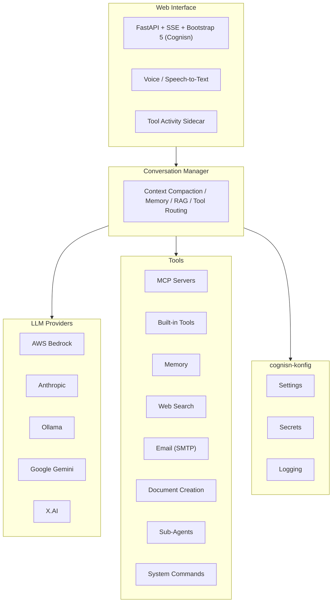

# Spark

[](LICENSE)
[](https://www.python.org/downloads/)
[](https://pypi.org/project/cognisn-spark/)
[](https://github.com/Cognisn/spark/actions/workflows/ci.yml)
[](https://sonarcloud.io/summary/overall?id=Cognisn_spark)
[](https://sonarcloud.io/summary/overall?id=Cognisn_spark)
[](https://sonarcloud.io/summary/overall?id=Cognisn_spark)
[](https://sonarcloud.io/summary/overall?id=Cognisn_spark)
[](https://sonarcloud.io/summary/overall?id=Cognisn_spark)
[](https://sonarcloud.io/summary/overall?id=Cognisn_spark)

**Spark** is a secure, multi-provider AI research kit with a modern web interface. It connects to AI models from Anthropic, AWS Bedrock, Google Gemini, Ollama, and X.AI, with features like MCP tool integration, intelligent context management, persistent memory, and autonomous scheduled actions.

## Features

### Conversations
- **Multi-Provider LLM Support** -- Claude, Gemini, Grok, Llama, Mistral, and more
- **Real-Time Streaming** -- Server-Sent Events for token-by-token responses
- **Dark/Light Theme** -- Cognisn design system with theme persistence
- **Context Compaction** -- LLM-driven summarisation when approaching context limits
- **Conversation Linking** -- Share context between related conversations
- **Favourites** -- Star conversations for quick access
- **Global System Instructions** -- Define persistent instructions applied to all conversations (Settings > Conversation)
- **Voice Conversation Mode** -- Hands-free AI interaction via the headset button with text-to-speech output and voice selection
- **Speech-to-Text Input** -- Dictate messages using the microphone button

### Tools
- **MCP Integration** -- Connect external tool servers via stdio, HTTP, or SSE; edit server configurations and view tools from the dashboard
- **Built-in Tools** -- Filesystem, documents (Word/Excel/PDF/PowerPoint), web search, archives, email, system commands
- **Document Creation** -- Create Word (.docx), Excel (.xlsx), PowerPoint (.pptx), and PDF documents with advanced formatting (headings, tables, lists, images, styles)
- **Email Tools** -- Send and draft emails via SMTP with HTML/plain text, attachments, and cc/bcc; SMTP test connection button
- **Memory Tools** -- Persistent semantic memory across conversations
- **Per-Conversation Control** -- Enable/disable tools at the server or individual level
- **4-Level Tool Approval** -- Deny, Approve Once, Always (Conversation), Always (Global) with category-based grouping
- **Resizable Sidecar** -- Tools and Agents tabs with drag-to-resize handle; entries grouped by date with collapsible headers; width persists in session
- **Agent Spawning** -- Spawn independent sub-agents for parallel research, analysis, and data gathering with dedicated Agents tab; supports orchestrator-workers and chain modes
- **Tool Documentation** -- Built-in `get_tool_documentation` tool for querying tool usage information
- **Web Search Engines** -- DuckDuckGo, Brave, Google/SerpAPI, Bing/Azure, SearXNG
- **System Commands** -- Execute shell commands and CLI tools (git, docker, aws, etc.) with OS-aware execution and configurable approval prompts

### Memory
- **Persistent Storage** -- Facts, preferences, projects, instructions, relationships
- **Semantic Search** -- Vector embeddings for relevant recall
- **Auto-Retrieval** -- Relevant memories silently injected into context
- **Import/Export** -- JSON format for backup and sharing

### Autonomous Actions
- **Scheduled Tasks** -- Cron or one-off schedules via APScheduler with local timezone support
- **AI-Assisted Creation** -- Describe what you want and the AI builds the action
- **Create from Conversation** -- Turn any conversation into an autonomous action with AI-guided setup
- **Run Now** -- Execute any action immediately from the Actions page
- **Background Daemon** -- System tray icon (macOS/Windows) runs actions independently with sleep/wake recovery
- **Run History** -- Track execution status, results, tool activity log, and token usage

### Dashboard
- **Provider Models Modal** -- Click any provider on the dashboard to view its available models
- **MCP Tools View** -- View tools provided by each MCP server directly from the dashboard
- **Provider Setup Guides** -- In-app step-by-step setup guides for all LLM providers

### Security
- **Prompt Inspection** -- Pattern and keyword-based threat detection
- **Secret Management** -- API keys stored in OS keychain, never in config files
- **Settings Lock** -- Password-protect the settings page
- **Tool Permissions** -- Per-conversation, per-tool approval system

### Updates
- **Auto-Update Checker** -- Checks GitHub releases for new versions; update from the Help menu

## Installation

### Download (Standalone)

Pre-built binaries with an embedded Python runtime and a native splash screen for first-run setup. Dependencies are downloaded from PyPI on first launch (~30-60 seconds, requires internet).

| Platform | Architecture | Format | Download |
|----------|-------------|--------|----------|
| macOS | ARM64 (Apple Silicon) | Signed + notarised DMG | [Download](https://github.com/Cognisn/spark/releases/latest) |
| macOS | x86_64 (Intel) | Signed + notarised DMG | [Download](https://github.com/Cognisn/spark/releases/latest) |
| Windows | x86_64 | Signed NSIS installer | [Download](https://github.com/Cognisn/spark/releases/latest) |
| Linux | Any | pip install (see below) | -- |

### Install from PyPI

```bash
pip install cognisn-spark
```

#### Optional database drivers

```bash
pip install cognisn-spark[postgresql]   # PostgreSQL
pip install cognisn-spark[mysql]        # MySQL
pip install cognisn-spark[mssql]        # SQL Server
pip install cognisn-spark[all-databases] # All drivers
```

## Quick Start

```bash
spark
```

On first launch, Spark creates a configuration file, starts the web server on a random port, and opens your browser. Follow the welcome page to configure an LLM provider and start chatting.

### Configuration

Spark stores its configuration in platform-standard locations:

| Platform | Config | Data | Logs |
|----------|--------|------|------|
| macOS | ~/Library/Application Support/spark/ | ~/Library/Application Support/spark/ | ~/Library/Logs/spark/ |
| Linux | ~/.config/spark/ | ~/.local/share/spark/ | ~/.local/state/spark/logs/ |
| Windows | %APPDATA%/spark/ | %APPDATA%/spark/ | %LOCALAPPDATA%/spark/logs/ |

API keys are stored in the OS keychain (macOS Keychain, Windows Credential Locker, Linux Secret Service) via the [cognisn-konfig](https://pypi.org/project/cognisn-konfig/) library.

## Architecture



## Keyboard Shortcuts

| Shortcut | Action |
|----------|--------|
| Ctrl/Cmd + K | Go to Conversations |
| Ctrl/Cmd + N | New Conversation |
| Ctrl/Cmd + , | Open Settings |
| Enter | Send message |
| Shift + Enter | New line |

## Development

```bash
git clone https://github.com/Cognisn/spark.git
cd spark
python -m venv .venv
source .venv/bin/activate
pip install -e ".[dev]"
pytest
```

## Changelog

See [CHANGELOG.md](CHANGELOG.md).

## Licence

MIT License with Commons Clause -- free for personal and educational use. Commercial use requires a licence from the author. See [LICENSE](LICENSE).

## Author

Matthew Westwood-Hill / [Cognisn](https://github.com/Cognisn)
