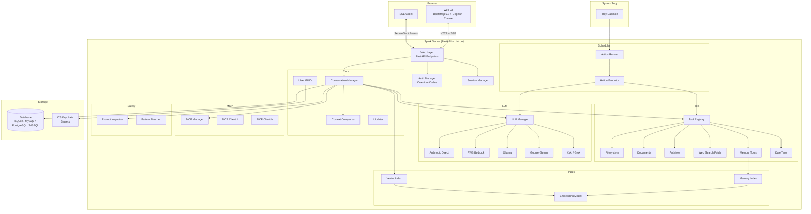
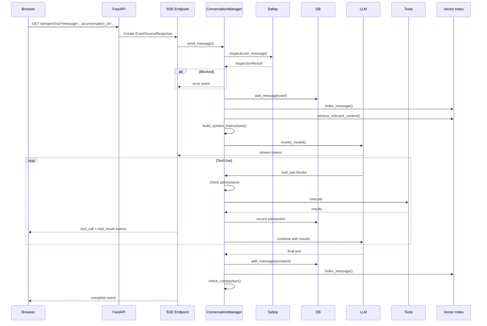
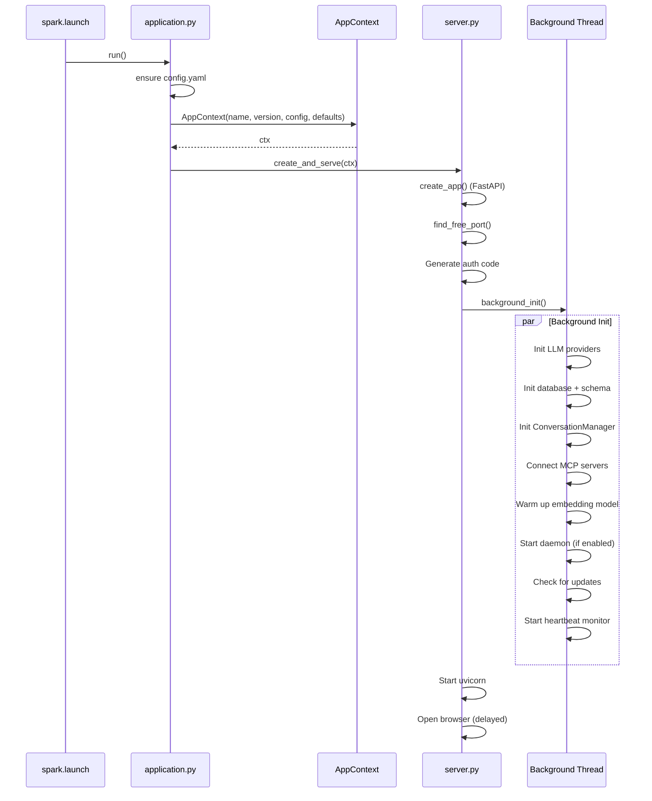

# Architecture

This document describes the system architecture, component overview, data flow, and database schema for Spark.

## High-Level Architecture



## Component Overview

### Web Layer

- **FastAPI** application with Jinja2 templates
- **Uvicorn** ASGI server (random port per startup)
- **SSE streaming** for real-time chat responses via `sse-starlette`
- **Auth middleware** protecting all routes except login/static
- **Static files** served from `web/static/` (CSS, JS, fonts)

### Core

- **ConversationManager** -- Central orchestrator connecting database, LLM, tools, MCP, memory, and compaction
- **ContextCompactor** -- LLM-driven intelligent context summarisation with categorised preservation
- **UserGUID** -- Persistent user identifier stored in the OS keychain
- **Updater** -- GitHub release checker with PyApp/pip update support

### LLM Layer

- **LLMManager** -- Routes requests across multiple registered providers
- **LLMService** -- Abstract base class that all providers implement
- **ContextLimitResolver** -- Resolves context window and max output for any model ID

Each provider normalises responses to a common format:

```python
{
    "content": str,          # Text response
    "stop_reason": str,      # end_turn, tool_use, max_tokens
    "usage": {
        "input_tokens": int,
        "output_tokens": int,
    },
    "tool_use": list | None, # Tool call blocks
    "content_blocks": list,  # Raw content blocks
}
```

### Tool System

- **ToolRegistry** -- Assembles enabled built-in tools and dispatches execution
- **ToolSelector** -- Intelligently selects relevant tools based on message content
- Each tool module exports `get_tools()` (definitions) and `execute()` (handler)

### MCP Integration

- **MCPManager** -- Manages multiple MCP server connections with tool caching
- **MCPClient** -- Client for a single server supporting stdio, HTTP, and SSE transports
- Tools from MCP servers are merged with built-in tools transparently

### Safety

- **PromptInspector** -- Multi-level prompt inspection with configurable actions
- **PatternMatcher** -- Compiled regex patterns for injection, jailbreak, code injection, and PII detection

### Index

- **ConversationVectorIndex** -- Per-conversation vector index for RAG retrieval
- **MemoryIndex** -- Cross-conversation persistent memory with semantic search
- **EmbeddingModel** -- Lazy-loaded sentence-transformers model (thread-safe singleton)

### Scheduler

- **ActionRunner** -- APScheduler-based background scheduler for autonomous actions
- **ActionExecutor** -- Runs a single action with its own LLM instance and tool access
- **CreationTools** -- AI-assisted action creation with validation and scheduling

### Daemon

- **SparkTrayDaemon** -- System tray application with pystray
- **DaemonManager** -- Process lifecycle management (start, stop, status)

## Request Flow

### Chat Message



## Startup Sequence



## Database Schema

### Entity Relationships

```mermaid
erDiagram
    conversations ||--o{ messages : contains
    conversations ||--o{ conversation_files : has
    conversations ||--o{ conversation_links : source
    conversations ||--o{ conversation_links : target
    conversations ||--o{ mcp_transactions : records
    conversations ||--o{ conversation_model_usage : tracks
    conversations ||--o{ conversation_mcp_servers : configures
    conversations ||--o{ conversation_embedded_tools : configures
    conversations ||--o{ conversation_tool_permissions : stores
    conversations ||--o{ context_index_elements : indexes
    conversations ||--o{ rollup_history : compacts

    autonomous_actions ||--o{ action_runs : executes
    autonomous_actions ||--o{ action_tool_permissions : permits
```



### Table Summary

| Table | Purpose |
|-------|---------|
| `conversations` | Conversation metadata, settings, token counts |
| `messages` | Message history (role, content, tokens, rollup status) |
| `rollup_history` | Context compaction records |
| `conversation_files` | Attached files (content + metadata) |
| `conversation_links` | Links between conversations for shared context |
| `mcp_transactions` | Tool execution audit log |
| `conversation_model_usage` | Per-model token usage tracking |
| `conversation_mcp_servers` | Per-conversation MCP server enable/disable |
| `conversation_embedded_tools` | Per-conversation tool enable/disable |
| `conversation_tool_permissions` | Tool approval status per conversation |
| `usage_tracking` | Global token usage and cost tracking |
| `prompt_inspection_violations` | Security violation records |
| `context_index_elements` | Vector index for RAG retrieval |
| `user_memories` | Persistent memories with embeddings |
| `autonomous_actions` | Scheduled action definitions |
| `action_runs` | Action execution history |
| `action_tool_permissions` | Tool permissions for actions |
| `daemon_registry` | Daemon process tracking |

### Key Columns: conversations

| Column | Description |
|--------|-------------|
| model_id | Active LLM model |
| instructions | Custom system prompt |
| total_tokens | Running token count |
| rag_enabled / rag_top_k / rag_threshold | RAG settings |
| max_history_messages | Message history limit |
| is_favourite | Star status |
| web_search_enabled | Web search toggle |
| memory_enabled | Memory tools toggle |

### Key Columns: autonomous_actions

| Column | Description |
|--------|-------------|
| action_prompt | The AI instruction |
| model_id | Which model to use |
| schedule_type | one_off or recurring |
| schedule_config | JSON (cron or run_at) |
| context_mode | fresh or cumulative |
| failure_count / max_failures | Auto-disable tracking |
| locked_by / locked_at | Execution lock |
