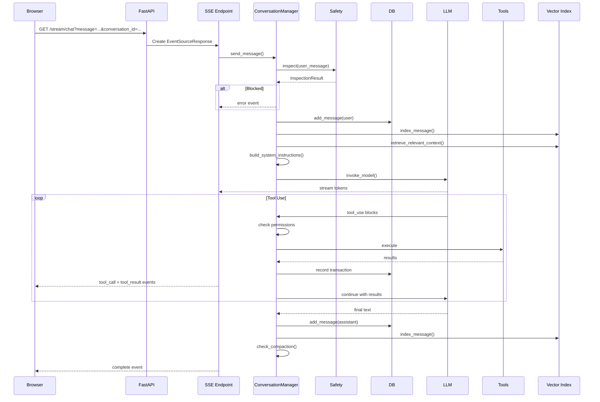
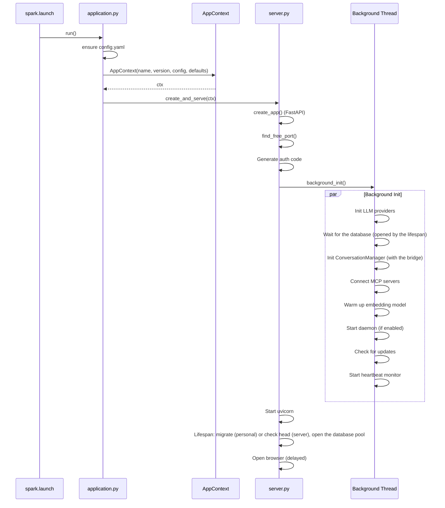
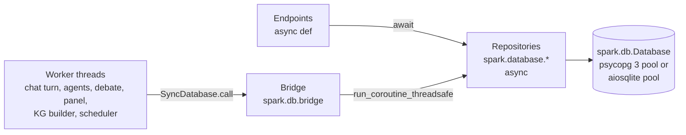
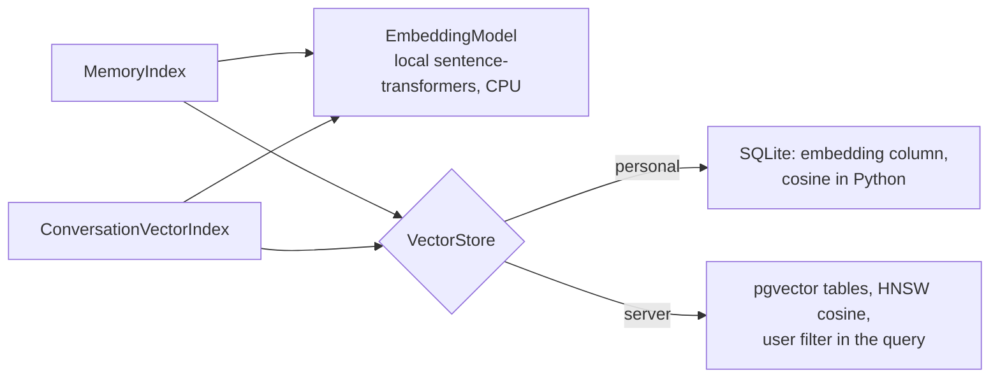

# Architecture

This document describes the system architecture, component overview, data flow, and database schema for Spark.

## High-Level Architecture

```mermaid
graph TB
    subgraph Browser
        UI[Web UI<br/>Bootstrap 5.3 + Cognisn Theme]
        SSE[SSE Client]
    end

    subgraph "Spark Server (FastAPI + Uvicorn)"
        Web[Web Layer<br/>FastAPI Endpoints]
        Auth[Auth Manager<br/>One-time Codes]
        Session[Session Manager]

        subgraph Core
            CM[Conversation Manager]
            CC[Context Compactor]
            UG[User GUID]
            UP[Updater]
        end

        subgraph LLM
            LM[LLM Manager]
            Anthropic[Anthropic Direct]
            Bedrock[AWS Bedrock]
            Ollama[Ollama]
            Gemini[Google Gemini]
            XAI[X.AI / Grok]
        end

        subgraph Tools
            TR[Tool Registry]
            FS[Filesystem]
            Doc[Documents]
            Arc[Archives]
            WebT[Web Search/Fetch]
            Mem[Memory Tools]
            DT[DateTime]
        end

        subgraph MCP
            MM[MCP Manager]
            MC1[MCP Client 1]
            MC2[MCP Client N]
        end

        subgraph Safety
            PI[Prompt Inspector]
            PM[Pattern Matcher]
        end

        subgraph Index
            VI[Vector Index]
            MI[Memory Index]
            EM[Embedding Model]
        end

        subgraph Scheduler
            AR[Action Runner]
            AE[Action Executor]
        end
    end

    subgraph "System Tray"
        TD[Tray Daemon]
    end

    subgraph Storage
        DB[(Database<br/>SQLite (personal) / PostgreSQL (server))]
        KC[OS Keychain<br/>Secrets]
    end

    UI <-->|HTTP + SSE| Web
    SSE <-->|Server-Sent Events| Web
    Web --> Auth
    Web --> Session
    Web --> CM
    CM --> LM
    CM --> TR
    CM --> MM
    CM --> CC
    CM --> PI
    CM --> VI
    LM --> Anthropic
    LM --> Bedrock
    LM --> Ollama
    LM --> Gemini
    LM --> XAI
    TR --> FS
    TR --> Doc
    TR --> Arc
    TR --> WebT
    TR --> Mem
    TR --> DT
    Mem --> MI
    MI --> EM
    VI --> EM
    CM --> DB
    TD --> AR
    AR --> AE
    AE --> LM
    AE --> TR
    UG --> KC
```

## Component Overview

### Web Layer

- **FastAPI** application with Jinja2 templates
- **Uvicorn** ASGI server (random port per startup)
- **SSE streaming** for real-time chat responses via `sse-starlette`
- **Auth middleware** protecting all routes except login/static, through `app.state.authenticator` (a `WebAuthenticator`: personal mode's single-use, expiring, rate-limited sign-in codes and one session; server mode's warden sessions, below)
- **Request guard** (`spark.web.security`) refusing state-changing requests and event streams that do not come from the instance's own origin, and state-changing requests without the session's CSRF token; pages send the token through `static/js/csrf.js`
- **Origin pin**: personal mode accepts its own bind address (or, bound to every address, the request's own Host); a server accepts exactly the origin of `server.public_base_url` (plus `interface.allowed_origins`) and refuses any other Host header, event streams included

### Warden sessions (server mode)

`spark.identity.runtime.IdentityRuntime` starts warden inside the web process once the
database is open: warden's configuration is derived from `server.public_base_url`
(required in server mode, https unless loopback) and the `warden` section of konfig;
the audit recorder is installed first; a missing signing key is rotated in and the
TOTP and CSRF keys are generated into konfig's secrets store, under an advisory lock
so replicas agree. `spark.identity.web.WardenAuthenticator` then answers the auth
middleware on every request:

| Cookie | Attributes | Holds |
|---|---|---|
| `__Host-spark-access` | HttpOnly, Secure, SameSite=Strict, path `/` | warden's access token (kept as long as the refresh token, so an expired one still reaches the server) |
| `__Secure-spark-refresh` | HttpOnly, Secure, SameSite=Strict, path `/auth/session/refresh` only | the rotating refresh token |

```mermaid
sequenceDiagram
    participant B as Browser
    participant M as Auth middleware
    participant R as /auth/session/refresh
    B->>M: GET /chat (access token expired)
    M-->>B: 303 /auth/session/refresh?next=/chat
    B->>R: GET (refresh cookie sent only here)
    R-->>B: 303 /chat, both cookies rotated
    B->>M: fetch /conversations/api/list (expired)
    M-->>B: 401 X-Spark-Session: refresh
    B->>R: POST (Origin and CSRF checked), csrf.js, one at a time
    R-->>B: 204, both cookies rotated; csrf.js retries the fetch
```

- A request with no usable session is sent to `/auth/sign-in?next=...` (page loads) or answered 401 with `X-Spark-Session: sign-in`. `next` is only ever a same-origin path.
- The signed-in user is `request.state.identity` (a `SparkIdentity`, permissions from warden) and `request.state.user_guid`, the guid mapped to the warden user (`user_identities`). Endpoints ask `spark.identity.access.current_user_guid(request)`, which in server mode never falls back to the process's own guid.
- CSRF: a session's token is an HMAC-SHA256 of its warden session id under a per-instance key in konfig's secrets store (`spark.csrf-key`), so it survives refreshes and never matches another session; the sign-in form has its own cookie-bound token.
- API keys: `Authorization: Bearer wdn_...` authenticates through warden (the key's scopes intersected with its user's permissions) and needs no CSRF token, having no ambient credential; Origin and Referer are still checked when present, and a bearer together with a session cookie is refused.
- Event streams cannot read a 401, so the chat, debate and panel pages call `SparkSession.ensure()` (in `csrf.js`) before opening one.
- `/auth/sign-out` (and the menu's `/logout`) revokes the warden session and clears both cookies.
- `spark identity create-admin --email EMAIL [--link-user-guid GUID]` creates the first administrator (idempotent) and can bind the interim single-user guid to them.
- **Static files** served from `web/static/` (CSS, JS, fonts)

### Identity screens (server mode)

SPARK renders every identity screen (Jinja and Bootstrap) and calls warden's Python API
on the server; warden's JSON routers are not mounted. Every route answers 404 in
personal mode, whose sign-in is unchanged.

| Screens | Module | Needs |
|---|---|---|
| `/auth/sign-in`, `/auth/challenge` (TOTP or recovery code; the enrolment warden requires, with the recovery codes shown once) | `endpoints/identity.py` | nothing (public) |
| `/auth/invitation`, `/auth/password-reset`, `/auth/reset`, `/identity/auth/sso/start` and `/callback`, `/auth/sso/complete` | `endpoints/lifecycle.py` | nothing (public) |
| `/account` (profile, password, authenticator), `/account/api-keys` | `endpoints/account.py` | a session; `spark.api_keys` for keys |
| `/admin/users`, `/admin/invitations`, `/admin/api-keys` | `endpoints/administration.py` | `spark.users.admin` |
| `/audit`, `/audit/export` (CSV or NDJSON) | `endpoints/audit.py` | `spark.audit.read`; `spark.audit.export` to export |

- **Before a session**: the screens extend the standalone `auth_layout.html`. Each form used before a session exists keeps its CSRF token in a cookie scoped to its own path (`__Secure-spark-sign-in` for sign-in, `__Secure-spark-form` for the invitation and reset screens); the challenge's token lives only in `__Secure-spark-challenge` (path `/auth/challenge`) and its forms' CSRF token is bound to it. Screens carrying a token or a secret are `no-store` and `no-referrer`, and the page takes a link's token out of the address bar. Under `no-referrer` a browser posts the screens' forms with `Origin: null`, so the Origin check treats `null` as no Origin and falls back to the Referer and then `Sec-Fetch-Site: same-origin`. Every refused code, link or handoff gets one fixed message.
- **TOTP**: the enrolment's `otpauth://` URI is drawn as a QR code on the server (`spark.web.qr`, reportlab's QR widget, an SVG data URI), beside the key and URI as text. warden 0.1.0 cannot replace a confirmed enrolment for its own user, so replacing one is an administrator's TOTP reset.
- **Single sign-on**: the provider's redirect URI is `server.public_base_url` + `/identity/auth/sso/callback` (warden's auth prefix). The login binding cookie (`__Secure-warden-sso`, SameSite=Lax) is scoped to `/identity/auth/sso`; the callback hands the same binding to `/auth/sso/complete` alone (`__Secure-spark-sso`), which exchanges the handoff code on the server and sets the session cookies.
- **Mail**: warden's `MailSender` is `spark.identity.mail.InstanceMail`, which reads the `mail.smtp` instance settings and the `mail_smtp_password` secret at each message, so a change applies to the next one on every replica. With `mail.smtp.host` set, `SmtpSender` delivers invitations, resends, password resets and second factor notices on a worker thread within 30 seconds, over STARTTLS or implicit TLS with the system's certificate authorities; plain text only to a loopback host. A failed delivery raises with a fixed reason (never a credential or the server's reply), which warden reports as not delivered: an administrator's screen says the link could not be sent, and a signed-out reset request keeps its neutral answer. With no host, `LinkCapture` is the sender: inside an administrator's invitation or reset request it keeps the message so the screen shows the link once; anywhere else (a signed-out reset request, warden's enrolment notice) the message is dropped. The instance page refuses a combination it cannot use (plain text to another host, a host without a sender address) and sends an administrator a test message (`POST /settings/api/mail/test`, audited as `spark.mail.test_sent`). `IdentityRuntime.start(mail_sender=...)` still takes another sender.
- **API keys**: a user's own key may not carry scopes beyond the permissions of the request creating it, so a key cannot mint a wider one (warden also caps scopes at the user's permissions).
- **Menu**: `spark.web.menu.identity_menu`, a template global, lists the entries the user's permissions allow in an Account menu with sign-out; it is empty in personal mode.
- **Audit**: warden records every identity and administration change itself, and its export records the export; the screens add no audit events of their own.

### Audit (server mode)

warden records its own identity and administration actions (sign-in, roles,
invitations, API keys) in its hash-chained audit trail (`warden.audit_events`).
SPARK records its own actions there too, through `spark.identity.audit`. Its action
catalogue (`ACTIONS`) is registered on warden's recorder when the identity runtime
starts, under `spark.`:

| Action | Severity | Resource | Recorded when |
|---|---|---|---|
| `spark.settings.instance.changed` | notice | `setting`, the key | an instance setting is set or cleared (in the write's transaction) |
| `spark.settings.secret.changed` | notice | `setting`, the key | a secret is set or cleared in konfig's secrets store |
| `spark.settings.preference.changed` | info | `setting`, the key | a user changes a preference |
| `spark.tool_result.flagged` | warning | `tool`, the tool | a tool result matches injection or jailbreak patterns (A16) |
| `spark.tool_result.policy_changed` | notice | `setting`, the key | an administrator changes a tool result action |
| `spark.tool.refused` | notice | `tool`, the tool | a tool is refused at dispatch, by role or by mode (outcome failure) |
| `spark.file.downloaded` | info | `file`, the file id | a user downloads a file from their file area |
| `spark.export.downloaded` | info | `conversation`, `memories`, `skill` or `usage` | a conversation export, memories export, skill download or usage export |
| `spark.action.refused` | warning | `action`, the action id | a scheduled action is refused for its owner (outcome failure) |
| `spark.usage.refused` | notice | `budget`, the month | a request is refused at 100% of the user's monthly token budget (outcome failure) |
| `spark.usage.viewed` | info | `usage`, the month | an administrator opens the usage view |
| `spark.usage.budget_changed` | notice | `role` or `user`, its name or guid | an administrator sets or removes a budget |

- **Actor**: the warden user id, as in warden's own events, so one actor filter shows a person's whole trail; the SPARK guid is kept in the details as `user_guid`. A guid with no warden user (or `operator`, a change made outside the web) is recorded as given.
- **Details** never carry a value or content: keys naming a value, secret, password, token, content, text, snippet, body, message or prompt are dropped at any depth (`scrub`).
- **Where events come from**: the hooks wave 2 left (`spark.instance_settings.audit` and `spark.safety.untrusted`), the tool registry's refusal hook (`spark.tools.registry.set_refusal_hook`, reported where every dispatch route asks `unavailable_reason`), the executor's refusal, and the download and export endpoints. The web lifespan installs the hooks while warden runs, and the active worker installs them while it holds the worker lock; personal mode installs none.
- **Transactions**: an instance setting's audit row is written in the setting's own transaction (warden's recorder joins it through the raw psycopg connection), so both commit or roll back together, and a failed audit fails the change. Secrets live in konfig's store, not the database, and preferences, downloads, exports, flagged results and refusals are recorded on their own, after the action.
- **Never in the way**: apart from that joined write, a failed audit is logged and never breaks the request or the turn. Hooks called on a worker thread schedule the write on the database's event loop without waiting.
- New code records an event with `await audit.emit_request(request, ...)` or `await audit.emit(...)` (async), `audit.submit(...)` (synchronous code on any thread) or `await audit.record_in(conn, ...)` inside a SPARK transaction; a new action is a new `ACTIONS` entry.

### Core

- **ConversationManager** -- Central orchestrator connecting database, LLM, tools, MCP, memory, and compaction; synchronous, runs on a worker thread per turn and reaches the database through the bridge (see Data Layer)
- **ContextCompactor** -- LLM-driven intelligent context summarisation with categorised preservation

### Usage and budgets (A14)

Every model call is metered: `spark.usage.meter.meter` wraps the LLM service a chat
turn, a sub-agent, a compaction, a debate or panel agent, or a scheduled action uses,
and records each call that returns usage as one `usage_tracking` row through the
bridge: the user it is billed to (an action's owner for an action), the model the
service was last set to, the source (`chat`, `compaction`, `agent`, `debate`, `panel`,
`action`), the conversation or action, and the period, the UTC calendar month
(`YYYY-MM`). Input tokens include prompt-cache reads and writes. Rows are only
inserted, so parallel turns for one user never lose tokens, and a failure to record
is logged and never breaks the call. The per-conversation, debate and action run
token counters are kept as before.

`spark.usage.budgets` decides a user's monthly limit: their own override
(`usage_user_budgets`, a number or explicitly unlimited) first; then, on a server, the
most generous budget among their roles that set one (`usage_role_budgets`);
otherwise none. Personal mode applies only the local user's own budget. `check` runs
as a turn starts, in `ConversationManager.send_message`, before each debate or panel
speaker's turn and each QA answer, and in `ActionExecutor.execute`: at 100% it raises
`BudgetExceeded` (audited as `spark.usage.refused`) with a message saying when the
budget resets, at 00:00 UTC on the first of the next month. A turn already running
always finishes, so parallel turns that each started under the budget can take the
month past it; the next request is refused. Callers pass the user's roles: the
request's identity for the web, and the owner's roles read from warden at run time
for the worker (`spark.scheduler.owners`).

On the web, `/api/usage/me` gives the signed-in user's standing, which the chat,
debate and panel pages show as a banner from 80% (`static/js/budget.js`). A refused
stream sends `budget_exceeded`; a refused QA question is answered 429. `/admin/usage`
and `/admin/usage/export.csv` (`spark.usage.admin`, Administrators only) show and
export usage by month, user and model and set the budgets; viewing, exporting and
changing a budget are audited. The ElevenLabs character cap is separate and stays
instance-wide.
- **UserGUID** -- Persistent user identifier stored in the OS keychain
- **Updater** -- GitHub release checker with PyApp/pip update support

### LLM Layer

- **LLMManager** -- Routes requests across multiple registered providers. On a server it
  follows `models.offered` (empty offers every model): `list_all_models()` lists only the
  models offered and `is_offered()` answers, by the same rule, whether a model may be
  chosen. `set_model()` never asks, so a conversation pinned to a model that has left
  the list keeps working. Sub-agents may be given only an offered model (the
  conversation's own model, used when none is named, keeps working), the models listed
  to the LLM for them are only those offered, and the action creation assistant may
  create an action only with an offered model. One manager serves every user of a
  server, so creating a conversation there never sets its model
- **A model service for each turn** -- `LLMManager.service_for(model_id)` returns a copy of
  the provider that lists the model with the model set on the copy: it shares the
  provider's client and caches, but its model is its own, and the manager's active
  provider and model never move. Like `set_model()` it does not ask whether the model is
  offered. Each chat turn resolves one for its conversation's model and uses it for every
  call it makes (invoking, token counting, the tool loop, prompt caching and compaction,
  which uses a service of its own when a compaction model is locked), so turns on
  different models at once never answer with each other's. Sub-agents, debates, panels
  and knowledge graph builds get a service of their own the same way. The only remaining
  caller of the shared `LLMManager.set_model()` is personal mode's conversation creation,
  for its single local user; a settings change replaces the providers and keeps the active
  one. A knowledge graph build's model is `knowledge_graph.build_model`, else the user's
  default model (`spark.web.models.default_model()`: the user's preference on a server,
  else the instance's, offered only; `config.yaml`'s in personal mode), else the first
  model listed
- **Models offered at every choice** (`spark.web.models`) -- Every endpoint where a user
  chooses a model asks `not_offered()` first and answers 409, naming the model, for one
  not offered: creating a conversation (its debate and panel agents included), changing
  a conversation's model, creating and editing an action, AI-creating an action,
  approving a sub-agent's model and the default model preference. The chat info
  (`model_offered`, `model_notice`) and page tell the user when their conversation's
  model is no longer offered. AI-creating an action answers through a service of its
  own for the chosen model, so no user's choice changes the shared manager's model.
  There is no per-role model permission: every signed-in user is offered the same models
- **LLMService** -- Abstract base class that all providers implement
- **ContextLimitResolver** -- Resolves context window and max output for any model ID

Each provider normalises responses to a common format:

```python
{
    "content": str,          # Text response
    "stop_reason": str,      # end_turn, tool_use, max_tokens
    "usage": {
        "input_tokens": int,
        "output_tokens": int,
    },
    "tool_use": list | None, # Tool call blocks
    "content_blocks": list,  # Raw content blocks
}
```

### Tool System

- **ToolRegistry** -- Assembles enabled built-in tools and dispatches execution. Every built-in tool belongs to a category (`TOOL_CATEGORIES`), each with a permission name `spark.tools.<category>`. `is_category_available()` is the one place that decides whether a category may be offered or run; registration, dispatch by name (conversation, sub-agent, scheduled action) and the settings API all ask it. In server mode the local-only categories (`filesystem`, `system_commands`, `email`) are unavailable whatever the role, and every other category needs `spark.tools.<category>` among the signed-in user's permissions. The permissions travel with the embedded tools configuration (`_permissions`, beside `_user_guid`) to the conversation manager, sub-agents, debates, panels and scheduled actions; without them a server refuses every built-in tool. Settings pages ask with `ANY_ROLE`, which is what the deployment offers. Personal mode has one local operator and ignores permissions
- **The user's own files** (`spark.tools.my_files`) -- `list_my_files` and `read_my_file`, in the `documents` category, list and read the signed-in user's file area by file id through `spark.files`, for the turn's `_user_guid` on the turn's bridge, in both modes (personal mode reads `<data directory>/files` whatever allowed_paths says). Another user's id answers as one that does not exist. Office and PDF files go through the document readers held to the user's area; other text is paged; binary files are refused. Results are untrusted document content
- **Command policy** (`spark.tools.command_policy`) -- Splits a system command line in the dialect of the shell that runs it (POSIX shells, cmd.exe, PowerShell), follows nested shells, and checks every command name against the blocklist; a line it cannot split with confidence is refused
- **ToolSelector** -- Intelligently selects relevant tools based on message content
- Each tool module exports `get_tools()` (definitions) and `execute()` (handler)

### MCP Integration

- **MCPManager** -- Manages multiple MCP server connections with tool caching. Its listings and calls take the caller's permissions: in server mode it offers only the servers those permissions grant (`spark.mcp.<server>`) and fails closed without them; every call, failure and refusal is audited (`spark.mcp.tool.called`, `spark.mcp.tool.refused`). `reconcile()` brings the connections in line with a new server list
- **MCPClient** -- Client for a single server supporting stdio, HTTP, and SSE transports (MCP SDK 1.x and 2.x). Each connection is owned by one task from opening to closing, as the SDK's anyio transports require
- **MCPRuntime** (`spark.mcp_integration.runtime`) -- The persistent event loop the sessions live on, on its own thread; turn threads dispatch onto it and the settings follower applies changes there
- **Server policy** (`spark.mcp_integration.servers`) -- What a server allows (HTTP and SSE only, permission-safe names, roles from `ROLES`, no credentials in the setting), the grants of a set of roles, and the configuration of an entry with its credentials from the secrets store
- **Grants** (`spark.mcp_integration.access`) -- warden defines roles at start-up, and MCP servers are run-time settings, so each server's `roles` live in `mcp.servers` and the auth middleware adds the granted `spark.mcp.<server>` permissions to each signed-in request (not to API key requests)
- In server mode the web process builds its servers from `mcp.servers` (instance settings, credentials from konfig's secrets store), never `config.yaml`, and the `SettingsFollower` reconnects the servers whose entry or credentials changed, on every replica
- Tools from MCP servers are merged with built-in tools transparently

### Safety

- **PromptInspector** -- Multi-level prompt inspection with configurable actions
- **PatternMatcher** -- Compiled regex patterns for injection, jailbreak, code injection, and PII detection
- **Untrusted content** (`spark.safety.untrusted`) -- Every result from an external source (web, MCP, documents and archives, sub-agents, and in personal mode files read from disk and system command output) reaches the model inside an `<untrusted-content>` block whose id is random for each turn, with block syntax inside the content neutralised; the system prompt tells the model to treat block contents as data. Results matching injection or jailbreak patterns are marked, warned about or withheld according to `embedded_tools.tool_results.<category>`, shown in the chat sidecar, recorded in `prompt_inspection_violations` and passed to a single audit hook (`set_audit_hook`). `guard_tool_result()` is the one call each tool loop makes

### Index

- **ConversationVectorIndex** -- Per-conversation vector index for RAG retrieval
- **MemoryIndex** -- Cross-conversation persistent memory with semantic search
- **SentenceTransformerEmbedding** -- Lazy-loaded sentence-transformers model (thread-safe singleton), the local implementation of the `spark.index.EmbeddingModel` protocol

### Scheduler

- **ActionRunner** -- APScheduler-based background scheduler for autonomous actions
- **ActionExecutor** -- Runs a single action with its own LLM instance and tool access, as one user (its owner, or the signed-in user for run now)
- **Owners** (`spark.scheduler.owners`) -- On a server, resolves an action owner's standing in warden at run time
- In personal mode the tray daemon runs the single local user's actions as that user. On a
  server `spark worker` runs every user's enabled actions
  (`autonomous_actions.get_enabled_actions_for_worker`, deliberately unscoped and called only
  by the worker), each as its owner. The worker has no user of its own and never reads the
  process's user guid (`spark.core.user_guid`, personal mode and the tray only): it builds a
  warden runtime over its own pool, as the web does but without the HTTP parts, and before
  each run reads the owner's warden user (`user_identities`), status and current
  permissions. An owner with no warden user, or one suspended or deactivated, is refused;
  the executor then refuses an owner without `spark.actions` (run now included). A refusal
  is recorded as a run with status `refused` and its reason, and the action stays enabled.
  An allowed run uses the owner's guid for its run records, memory index and file area
  (`_user_guid`, `_files_db`), and the owner's permissions for its tools. A refusal is
  also audited (`spark.action.refused`).
- **warden's housekeeping** (`spark.identity.pruning`) -- The active worker builds one warden
  runtime for all its duties and prunes warden's data: `identity.pruning(every_seconds=...)`
  (expired refresh and single-use tokens, MFA challenges, sign-in throttle windows) and
  `identity.sso.prune()` every `worker.identity_prune_seconds` (default 3600), and, when
  `warden.audit.retention_days` is set, warden's audit retention purge every
  `worker.audit_purge_seconds` (default 86400). The purge needs `DELETE` on the audit
  table; a refused purge is logged and tried again.
- Action names are unique per user (`UNIQUE(user_guid, name)`); a clash answers 409 and
  names only the caller's own action.
- **CreationTools** -- AI-assisted action creation with validation and scheduling

### Daemon

- **SparkTrayDaemon** -- System tray application with pystray
- **DaemonManager** -- Process lifecycle management (start, stop, status)

## Request Flow

### Chat Message


```mermaid
sequenceDiagram
    participant Browser
    participant FastAPI
    participant SSE as SSE Endpoint
    participant CM as ConversationManager
    participant Safety
    participant DB
    participant LLM
    participant Tools
    participant VectorIdx as Vector Index

    Browser->>FastAPI: GET /stream/chat?message=...&conversation_id=...
    FastAPI->>SSE: Create EventSourceResponse
    SSE->>CM: send_message()
    CM->>Safety: inspect(user_message)
    Safety-->>CM: InspectionResult

    alt Blocked
        CM-->>SSE: error event
    end

    CM->>DB: add_message(user)
    CM->>VectorIdx: index_message()
    CM->>VectorIdx: retrieve_relevant_context()
    CM->>CM: build_system_instructions()
    CM->>LLM: invoke_model()
    LLM-->>SSE: stream tokens

    loop Tool Use
        LLM->>CM: tool_use blocks
        CM->>CM: check permissions
        CM->>Tools: execute
        Tools-->>CM: results
        CM->>DB: record transaction
        SSE-->>Browser: tool_call + tool_result events
        CM->>LLM: continue with results
    end

    LLM-->>CM: final text
    CM->>DB: add_message(assistant)
    CM->>VectorIdx: index_message()
    CM->>CM: check_compaction()
    SSE-->>Browser: complete event
```

### Chat attachments

The composer's attach button (`static/js/attachments.js`) uploads each file to `POST /files/api` with the conversation id, through the CSRF-wrapped fetch; the upload limit and the user's quota apply there (413, 507), and a file over the limit is refused in the browser before it is sent. Sending the message passes the file ids (`attachments` on `/stream/chat`, or in the body of `/chat/<id>/api/send`). `spark.web.attachments.attach` checks each id is the signed-in user's own file (404 otherwise) and appends a note naming the files by id and name, never their content, so the conversation stores the note and the model reads a file with `read_my_file`. The chat page parses the note back into chips that download the file. The conversation manager is unchanged.

## Startup Sequence


```mermaid
sequenceDiagram
    participant Entry as spark.launch
    participant App as application.py
    participant Konfig as AppContext
    participant Server as server.py
    participant BG as Background Thread

    Entry->>App: run()
    App->>App: ensure config.yaml
    App->>Konfig: AppContext(name, version, config, defaults)
    Konfig-->>App: ctx
    App->>Server: create_and_serve(ctx)
    Server->>Server: create_app() (FastAPI)
    Server->>Server: find_free_port()
    Server->>Server: Generate auth code
    Server->>BG: background_init()

    par Background Init
        BG->>BG: Init LLM providers
        BG->>BG: Wait for the database (opened by the lifespan)
        BG->>BG: Init ConversationManager (with the bridge)
        BG->>BG: Connect MCP servers
        BG->>BG: Warm up embedding model
        BG->>BG: Start daemon (if enabled)
        BG->>BG: Check for updates
        BG->>BG: Start heartbeat monitor
    end

    Server->>Server: Start uvicorn
    Server->>Server: Lifespan: migrate (personal) or check head (server), open the database pool
    Server->>Server: Open browser (delayed)
```

`application.run()` validates the mode first (`spark.mode.configure`): server mode
refuses to start without a PostgreSQL `database.url` or a valid `server.public_base_url`,
or with an invalid `warden` section. A server generates no sign-in code and opens no
browser; its lifespan also starts warden's runtime (above).

## Modes

One codebase, two modes, chosen by the `mode` setting (`SPARK__MODE`), read once at
start-up. Code asks `spark.mode.current_mode()` or `spark.mode.is_server()`, never
the raw settings.

| | Personal | Server |
|---|---|---|
| Database | SQLite in the platform data directory | PostgreSQL from `database.url` (`SPARK__DATABASE__URL`) |
| Schema changes | applied automatically at start-up | `spark migrate` first; start-up refuses a database behind head |
| Users | one local user, terminal sign-in code | multi-user, signed in through warden (email and password, second factor, API keys) |
| Local tools | system command, filesystem and email tools available | not registered, refused by name, settings hidden |

## Data Layer


```mermaid
flowchart LR
    EP[Endpoints<br/>async def] -->|await| R[Repositories<br/>spark.database.*<br/>async]
    W[Worker threads<br/>chat turn, agents, debate, panel,<br/>KG builder, scheduler] -->|SyncDatabase.call| BR[Bridge<br/>spark.db.bridge]
    BR -->|run_coroutine_threadsafe| R
    R --> DB[(spark.db.Database<br/>psycopg 3 pool or<br/>aiosqlite pool)]
```

- `spark.db.Database` owns the connections (a psycopg 3 `AsyncConnectionPool` in server
  mode, a WAL-mode aiosqlite pool in personal mode) and is bound to the event loop that
  opened it: uvicorn's loop in the web process, its own loop thread in the tray daemon
  (`spark.db.standalone`).
- Repositories in `spark.database` are async functions taking an `Executor` (a
  `Database` or a `Connection`) first. SQL is written once with `?` placeholders in the
  subset both engines accept; `spark.db.dialect` adapts it.
- `Database.transaction(conn)` joins a caller's transaction through a savepoint, so a
  second writer (warden's audit recorder, in server mode) commits or rolls back with
  the caller.
- Synchronous code on worker threads uses `SyncDatabase.call(repo.fn, *args)`, the one
  documented bridge. It refuses to run on the database loop's own thread (that would
  deadlock) and times out instead of hanging. A unit of work needing several statements
  is one repository coroutine, never a connection held across bridged calls.
- PostgreSQL sessions run in UTC in the `spark` schema; timestamps are returned as
  ISO 8601 text in both engines. Pool connections register pgvector, so numpy arrays
  are sent as `vector` values and `vector` columns come back as numpy arrays.

### User scoping

- Every repository read and write a user's request can reach takes the caller's user
  guid (after the executor) and is scoped by it. Rows with their own `user_guid` filter
  on it; rows reached through a parent id (a conversation's messages, files, tool
  states, index elements, agent runs and debate turns; an action's runs and tool
  permissions; a turn's exhibits) are scoped through the parent's owner, with the
  subqueries in `spark.database.scope` (`OWNED_CONVERSATIONS`, `OWNED_ACTIONS`). A
  caller holding another user's id gets nothing back and changes nothing; a write
  under another user's parent raises `NotOwned` or returns without writing.
- Endpoints answer such an id with 404, exactly as for an id that does not exist, so
  one user never learns that another user's data exists (`spark.web.scope`).
- Deliberately unscoped, and never reached from a user's request: the scheduler
  worker's listing of every user's enabled actions (`get_enabled_actions_for_worker`,
  each row carrying its owner) and its action locks (`try_lock_action`,
  `unlock_action`, `clear_stale_locks`), usage retention (`usage.cleanup_old_usage`)
  and personal mode's start-up move of memories from the 0.1 placeholder guid
  (`memories.reassign_user`).
- One conversation manager serves every user of a server. A turn's user guid and its
  interactive callbacks (tool approval, agent model approval, agent cancellation,
  `TurnCallbacks`) are passed down each call to memory tools, the knowledge graph
  tools, file tools and sub-agents, never kept on the shared instance. Personal mode's
  single local user is used only when a call names no user, and never on a server.
- On a server, the routes that act on the host process (`/api/quit`,
  `/api/open-folder`, `/settings/api/lock`, `/settings/api/unlock`) answer 404, and
  the MCP server settings (`/settings/mcp/*`, which on a server write the
  `mcp.servers` instance setting and the secrets store) need
  `spark.settings.instance`.
- A chat stream's pending interactions are addressed by id through app-wide
  registries: tool permission prompts (`/chat/permission/respond`), agent model
  approvals (`/chat/agent/model-approve`), agent cancel tokens (`/chat/agent/cancel`)
  and the stream itself (`/stream/cancel`). `spark.web.interactions` binds each id to
  the user whose turn raised it and releases it when it ends; on a server an id that
  is not the caller's live one answers 404 and changes nothing. Personal mode answers
  every id, unknown ones with 200, as before.
- Role gates (server mode; personal mode's local operator holds every permission):
  creating, editing, toggling, running now and AI-creating actions need
  `spark.actions` (`require_permission`), while listing, reading and deleting one's own
  actions stay open; importing, deleting and reloading skills, which every user of
  the instance shares, need `spark.settings.instance`, while turning a skill on or off
  for oneself stays open. Spawning a sub-agent needs `spark.agents` at the one point
  every sub-agent starts (`ConversationManager._execute_agent_spawn`, for chat turns,
  actions and agents alike); `spark.tools.agents` only offers the tool. Knowledge graph
  builds are per user (each user's own global and conversation graphs). On a server the
  global graph, built from all of a user's conversations and memories, needs
  `spark.knowledge.instance` to build, retry or clear: checked by the knowledge endpoint
  and again by the worker against the owner's permissions when it runs the build.
  Conversation graphs need no extra permission.

## Knowledge graph builds

- **Personal mode** builds in the web process on a thread, as in 0.2.0: one build per
  user and scope (`spark.knowledge.builder.try_acquire`), with its cancel token and
  last result held in the process.
- **Server mode** never builds in a web process. `POST /knowledge/api/build` queues a
  job in `kg_build_jobs` (`spark.knowledge.jobs.enqueue`) with the model resolved for
  the user; a partial unique index allows one queued or running job per user and
  scope, so a second request on any replica answers 409. Status, progress, cancel
  (`/knowledge/api/cancel`) and retry (`/knowledge/api/retry`, failed jobs only) read
  and write the job, so any web replica answers for any build.
- **The worker's job** (`spark.knowledge.build_jobs`, registered with
  `spark.worker.register_periodic` as `knowledge-graph-builds`, every
  `worker.knowledge_graph_poll_seconds`, 5 by default) claims the oldest queued job with
  `FOR UPDATE SKIP LOCKED`, so two workers claiming at once never take the same job.
  It resolves the owner through warden at run time (`spark.scheduler.owners`), refusing
  and auditing (`spark.knowledge.build.refused`) an owner who is not active or a global
  build without `spark.knowledge.instance`, then runs the in-process engine on a thread
  as the owner, with every read and write scoped to the owner's guid. Its model client
  comes from `spark.llm.factory`, which builds providers from the instance settings by
  the web process's rules without any web app. Progress is written to the job (its
  heartbeat); before each chunk the build stops if the owner cancelled or the job is no
  longer this worker's. The outcome (complete, failed or cancelled) is recorded on the
  job. A job left running with no progress for `worker.knowledge_graph_stale_seconds`
  (30 minutes by default), by a worker that stopped, is failed so its owner can retry it.

## Vectors


```mermaid
flowchart LR
    MI[MemoryIndex] --> EM[EmbeddingModel<br/>local sentence-transformers, CPU]
    CI[ConversationVectorIndex] --> EM
    MI --> VS{VectorStore}
    CI --> VS
    VS -->|personal| SQ[SQLite: embedding column,<br/>cosine in Python]
    VS -->|server| PG[pgvector tables, HNSW cosine,<br/>user filter in the query]
```

- `spark.index.EmbeddingModel` (protocol: `name`, `dimension`, `embed(texts)`) turns
  texts into L2-normalised vectors. `SentenceTransformerEmbedding` is the local
  implementation; provider embeddings can implement the same protocol later.
- `spark.index.VectorStore` (protocol: `add`, `delete`, `search`, `items`, `rebuild`)
  keeps one vector per memory or context element and searches them for one user.
  `vector_store(MEMORIES | CONTEXT, dialect)` picks the implementation.
- Personal mode keeps the 0.2.0 approach: the vector is the item's `embedding` column
  and search ranks the candidate rows in Python.
- Server mode also writes `memory_vectors` and `context_vectors` (one row per item,
  `ON DELETE CASCADE`) and searches in PostgreSQL: `ORDER BY` cosine distance on a
  partial HNSW index per dimension, with the user filter in the same query and
  pgvector's iterative index scan so the filter never starves the result.
- Every stored vector records its dimension. A vector or query of another dimension
  is refused (`EmbeddingDimensionMismatch`) until the index is rebuilt with the new
  model (`MemoryIndex.rebuild()`, `ConversationVectorIndex.rebuild()`).

## Migrations

An Alembic chain in `src/spark/migrations/`, run by `spark.db.migrate`:

- PostgreSQL: SPARK's tables and `spark.alembic_version` live in the `spark` schema;
  SQLite uses the default schema.
- Revision `0001` (baseline) is the SPARK 0.2.0 schema exactly, built from its frozen
  statements (`spark/migrations/schema_0_2_0.py`).
- A SQLite database from 0.2.x or earlier (tables, no version table) gets a one-time
  legacy upgrade: 0.2.0's statements and ALTERs, a check of every column and index
  against the baseline (refusing and changing nothing on any difference), then a stamp.
- Revision `vector_store_1` (PostgreSQL only; nothing on SQLite) creates the `vector`
  extension if missing, `memory_vectors` and `context_vectors`, and an HNSW cosine
  index for 384-dimension vectors, copying existing embeddings in.
- Revision `vector_store_2` merges duplicate knowledge graph nodes and edges, skill
  states and conversation skill states, then makes their natural keys unique.
- Revision `user_identities` creates `user_identities` (`user_guid` primary key,
  `warden_user_id` unique), mapping each SPARK user guid onto one warden user. Every
  existing `user_guid` column is untouched: a guid made before warden (the single
  local user's) is linked to a warden user, and a new warden user's guid is created on
  first use (`spark.database.user_identities`).
- Revision `action_names_per_user` replaces the global `UNIQUE(name)` of
  `autonomous_actions` with `UNIQUE(user_guid, name)` (SQLite rebuilds the table).
  Its downgrade refuses, changing nothing, while two users share an action name.
- Revision `kg_build_jobs` creates `kg_build_jobs`, the server's knowledge graph build
  queue (owner, scope, model, status, attempts, cancel request, worker, progress, result,
  error and times), with a partial unique index allowing one queued or running job per
  user and scope. Personal mode leaves it empty. Its downgrade drops the table.
- `spark migrate` runs SPARK's chain, then every chain registered with
  `spark.db.migrate.register_chain`, and prints each chain's revision.
  `spark.identity.migrations` registers warden's chain, which keeps its tables and
  `warden.alembic_version` in its own `warden` schema. It is PostgreSQL only: on
  SQLite it is skipped. `spark migrate`, the web lifespan and the worker all register
  it, so in server mode start-up also refuses a database whose warden chain is behind.
- warden shares SPARK's psycopg pool (`spark.identity.db.warden_database`); an audit
  write given the driver connection of a SPARK transaction commits or rolls back with it.
- Roles and permissions are data in `spark.identity.permissions`: `PERMISSIONS` (one
  `spark.tools.<category>` per tool category, plus `spark.actions`, `spark.agents`,
  `spark.knowledge.instance`, `spark.settings.instance`, `spark.users.admin`,
  `spark.audit.read`, `spark.audit.export` and `spark.api_keys`) and `ROLES`
  (`administrator` with every permission and warden's last-administrator protection,
  `auditor` with the audit trail only, `user` with the tools a server offers bar
  sub-agents, and `power_user` adding actions, sub-agents and instance-wide knowledge
  graphs). `build_registry()` declares them to warden, which stores only assignments; a
  new role is a new `ROLES` entry.
- The signed-in user is a `SparkIdentity` on `request.state.identity`
  (`spark.identity.access`), built from warden's `Principal` and the user's guid. Checks
  fail closed: without an identity a request holds no permission. In server mode the web
  start-up installs `WardenAccess` as the instance settings access check, so only a
  holder of `spark.settings.instance` changes instance settings and secrets; personal
  mode keeps its single operator, who holds every permission.

## Database Schema

### Entity Relationships


```mermaid
erDiagram
    conversations ||--o{ messages : contains
    conversations ||--o{ conversation_files : has
    conversations ||--o{ conversation_links : source
    conversations ||--o{ conversation_links : target
    conversations ||--o{ mcp_transactions : records
    conversations ||--o{ conversation_model_usage : tracks
    conversations ||--o{ conversation_mcp_servers : configures
    conversations ||--o{ conversation_embedded_tools : configures
    conversations ||--o{ conversation_tool_permissions : stores
    conversations ||--o{ context_index_elements : indexes
    conversations ||--o{ rollup_history : compacts

    autonomous_actions ||--o{ action_runs : executes
    autonomous_actions ||--o{ action_tool_permissions : permits
```

### Table Summary

| Table | Purpose |
|-------|---------|
| `conversations` | Conversation metadata, settings, token counts |
| `messages` | Message history (role, content, tokens, rollup status) |
| `rollup_history` | Context compaction records |
| `conversation_files` | Attached files (content + metadata) |
| `conversation_links` | Links between conversations for shared context |
| `mcp_transactions` | Tool execution audit log |
| `conversation_model_usage` | Per-model token usage tracking |
| `conversation_mcp_servers` | Per-conversation MCP server enable/disable |
| `conversation_embedded_tools` | Per-conversation tool enable/disable |
| `conversation_tool_permissions` | Tool approval status per conversation |
| `usage_tracking` | Token usage per model call: user, model, source, conversation or action, UTC month |
| `usage_role_budgets` | Monthly token budget per role |
| `usage_user_budgets` | Per-user budget override (NULL: unlimited) |
| `prompt_inspection_violations` | Security violation records |
| `context_index_elements` | Vector index for RAG retrieval |
| `user_memories` | Persistent memories with embeddings |
| `autonomous_actions` | Scheduled action definitions |
| `action_runs` | Action execution history |
| `action_tool_permissions` | Tool permissions for actions |
| `daemon_registry` | Daemon process tracking |

### Key Columns: conversations

| Column | Description |
|--------|-------------|
| model_id | Active LLM model |
| instructions | Custom system prompt |
| total_tokens | Running token count |
| rag_enabled / rag_top_k / rag_threshold | RAG settings |
| max_history_messages | Message history limit |
| is_favourite | Star status |
| web_search_enabled | Web search toggle |
| memory_enabled | Memory tools toggle |

### Key Columns: autonomous_actions

| Column | Description |
|--------|-------------|
| action_prompt | The AI instruction |
| model_id | Which model to use |
| schedule_type | one_off or recurring |
| schedule_config | JSON (cron or run_at) |
| context_mode | fresh or cumulative |
| failure_count / max_failures | Auto-disable tracking |
| locked_by / locked_at | Execution lock |
