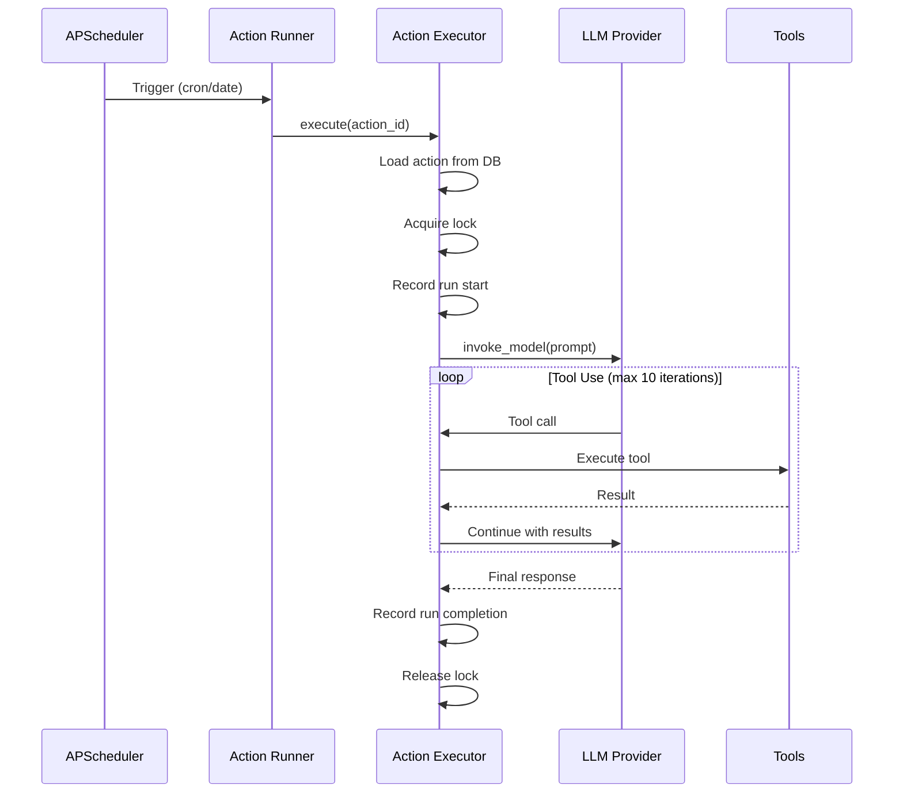

# Autonomous Actions

Autonomous actions let you schedule AI tasks that run automatically in the background. Actions can use all available tools (filesystem, web, memory, MCP) and run on cron schedules or as one-off tasks.

## Enabling Actions

Autonomous actions must be enabled in the configuration:

```yaml
autonomous_actions:
  enabled: true

daemon:
  enabled: true     # Enable the background daemon for headless execution
```

Once enabled, the **Actions** page appears in the navigation.

## Creating Actions

### Manual Creation

1. Go to **Actions** and click **New Action**
2. Fill in the form:
   - **Name** -- Unique identifier for the action
   - **Description** -- Brief explanation of what it does
   - **Model** -- Which LLM model to use
   - **Prompt** -- The instruction for the AI
   - **Schedule type** -- One-off or recurring
   - **Schedule** -- Date/time (one-off) or cron expression (recurring)
   - **Context mode** -- Fresh or cumulative
   - **Max failures** -- Auto-disable after N consecutive failures (default: 3)
   - **Max tokens** -- Output token limit (default: 8192)

### AI-Assisted Creation

Click **Create with AI** to open a guided chat session. Describe what you want the action to do and the AI will:

1. Ask clarifying questions about the task
2. Suggest a schedule (validating cron expressions)
3. Generate the action prompt
4. Present a summary for confirmation
5. Create the action when you confirm

The AI assistant has access to three creation tools:

- `list_available_tools` -- Shows what tools the action can use
- `validate_schedule` -- Checks a cron or datetime expression
- `create_autonomous_action` -- Creates the action in the database

### Create from Conversation

You can create an autonomous action directly from any conversation by clicking the play-circle icon in the chat header. The AI analyses the conversation content and guides you through setting up an action that automates the workflow you were working on.

The assistant receives the last 30 messages as context and uses the same LLM model as the conversation. This is particularly useful for turning ad-hoc research, analysis, or reporting tasks into scheduled automations.

## Schedule Types

### One-Off

Runs once at a specific date and time.

Format: `YYYY-MM-DD HH:MM`

```
2026-04-01 09:00
```

### Recurring (Cron)

Runs on a repeating schedule defined by a 5-field cron expression:

```
minute hour day month day_of_week
```

| Expression | Meaning |
|-----------|---------|
| `0 8 * * 1-5` | Weekdays at 8:00 AM |
| `0 */6 * * *` | Every 6 hours |
| `30 9 1 * *` | 1st of every month at 9:30 AM |
| `*/10 * * * *` | Every 10 minutes |
| `0 0 * * 0` | Sundays at midnight |

## Context Modes

| Mode | Behaviour |
|------|-----------|
| **fresh** | Each run starts with a clean context. Only the action prompt is sent. |
| **cumulative** | Previous run results (up to 5) are included in the system prompt, allowing the AI to build on past results. |

Cumulative mode is useful for monitoring tasks where the AI should compare current results with previous runs.

## Action Execution



### Failure Handling

- Each action tracks consecutive failures via `failure_count`
- After `max_failures` consecutive failures (default: 3), the action is automatically disabled
- Successful runs reset the failure count to zero
- Actions are locked during execution to prevent concurrent runs

## System Tray Daemon

When the daemon is enabled, Spark starts a system tray application that:

- Runs independently of the web UI
- Shows a blue lightning bolt icon when active (grey when paused)
- Provides a menu with:
  - Action count and scheduling status
  - Last run / next run times
  - **Open Spark** -- Opens the web UI (starts it if not running)
  - **Open Log Folder** -- Opens the log directory
  - **Pause / Resume** -- Temporarily stop/start action execution
  - **Quit** -- Stop the daemon

The daemon automatically:

- Loads enabled actions from the database on startup
- Polls for changes every 30 seconds
- Schedules actions using APScheduler
- Removes jobs for disabled/deleted actions

### Running the Daemon Standalone

The daemon can be started independently:

```bash
spark-daemon
```

Or via Python:

```bash
python -m spark.daemon.tray
```

## Managing Actions

The **Actions** page provides:

- **Enable/disable** toggle per action
- **Edit** action configuration (prompt, schedule, tools, settings)
- **Run history** with results, token usage, and error details
- **Delete** actions
- **Tool permissions** per action (separate from conversation permissions)

## Database Tables

Actions use two main tables:

### autonomous_actions

Stores action definitions including name, prompt, model, schedule configuration, context mode, failure tracking, and locking fields.

### action_runs

Records each execution with start/completion times, status (running/completed/failed), result text, error messages, and token usage.
