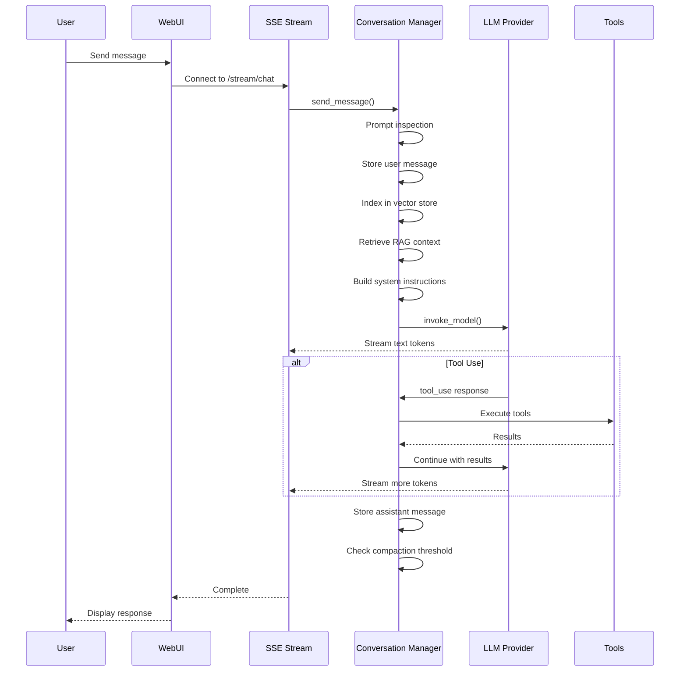

# Conversations

Conversations are the core interaction unit in Spark. Each conversation maintains its own message history, model selection, tool permissions, and settings.

## Creating a Conversation

1. Navigate to **Conversations** from the main menu
2. Click **New Conversation**
3. Enter a name and select a model from the available providers
4. Optionally add custom instructions (system prompt for this conversation)
5. Click **Create**

If a default model is configured in Settings, it will be pre-selected.

## Chat Interface

The chat page provides:

- **Message input** with Enter to send and Shift+Enter for new lines
- **Streaming responses** with real-time text rendering
- **Tool call cards** showing each tool invocation with expandable parameters and results
- **Token counter** displaying input/output tokens for the current exchange
- **Voice input** via the microphone button (browser speech recognition)
- **Voice mode** for hands-free conversation (see [Voice](voice.md))

## Message Handling

### Tool Use Loop

When the model requests tool use, Spark enters a tool execution loop:

1. The model returns one or more tool calls
2. Spark checks tool permissions (prompting the user if needed)
3. Each tool is executed and results are collected
4. Tool results are sent back to the model
5. The model either requests more tools or returns a text response

The loop is bounded by `max_tool_iterations` (default: 25) to prevent runaway tool use.

## Context Compaction

As conversations grow, they can approach the model's context window limit. Spark uses LLM-driven summarisation to compact the context intelligently.

### How It Works

1. **Threshold check:** After each exchange, Spark checks if total tokens exceed `rollup_threshold` (default: 30% of context window)
2. **LLM summarisation:** The entire conversation is sent to the model with a structured summarisation prompt
3. **Categorised output:** The summary preserves critical decisions, unresolved issues, and implementation details while compressing resolved topics
4. **Message replacement:** Original messages are marked as "rolled up" and replaced with the compact summary
5. **Emergency fallback:** If tokens reach `emergency_rollup_threshold` (95%), a simpler truncation is used as a last resort

### Compaction Categories

The summarisation prompt instructs the model to categorise information:

- **PRESERVE (full fidelity):** Architectural decisions, unresolved issues, code paths, user preferences, active tasks, error context
- **COMPRESS (reduced fidelity):** Resolved tasks, exploratory discussion, tool outputs, explanations
- **DISCARD:** Redundant information, pleasantries, superseded decisions

### Per-Conversation Settings

In the conversation settings (gear icon), you can configure:

- **Compaction threshold** -- Override the global threshold
- **Compaction model** -- Use a different model for summarisation
- **Summary ratio** -- Target size relative to original (default: 30%)

## Conversation Linking

Conversations can be linked together to share context. When conversation A is linked to conversation B, relevant context from B is automatically included when querying A.

### Setting Up Links

1. Open a conversation
2. Click the gear icon for settings
3. Go to the **Context** tab
4. Under **Linked Conversations**, select conversations to link

Linked conversations are searched via the vector index during RAG retrieval, so context from linked conversations appears when semantically relevant.

## RAG (Retrieval-Augmented Generation)

Each conversation maintains a vector index of all messages, tool calls, and tool results. When you send a new message, Spark:

1. Encodes the message using the embedding model (all-MiniLM-L6-v2)
2. Searches the current conversation's vector index (and linked conversations)
3. Retrieves the top-k most relevant context items above the similarity threshold
4. Injects the retrieved context into the system prompt

### Per-Conversation RAG Settings

- **rag_enabled** -- Enable/disable RAG for this conversation (default: true)
- **rag_top_k** -- Number of context items to retrieve (default: 5)
- **rag_threshold** -- Minimum similarity score (default: 0.4)

## Favourites

Star a conversation to mark it as a favourite. Favourites appear at the top of the conversation list and on the dashboard.

## Conversation Export

Export a conversation from the chat settings menu. Available formats:

| Format | Description |
|--------|-------------|
| **Markdown** | Full conversation with formatting preserved |
| **HTML** | Rendered HTML with styling |
| **CSV** | Tabular format (timestamp, role, content) |
| **JSON** | Raw message data for programmatic use |

## Conversation Settings Summary

| Setting | Description | Default |
|---------|-------------|---------|
| Instructions | Custom system prompt | None |
| Model | LLM model to use | Per-provider default |
| RAG enabled | Vector search context retrieval | true |
| RAG top_k | Number of context items | 5 |
| RAG threshold | Minimum similarity | 0.4 |
| Max history messages | Limit messages sent to model | All |
| Include tool results | Send tool results in history | true |
| Web search enabled | Enable web search tool | false |
| Memory enabled | Enable memory tools | true |
