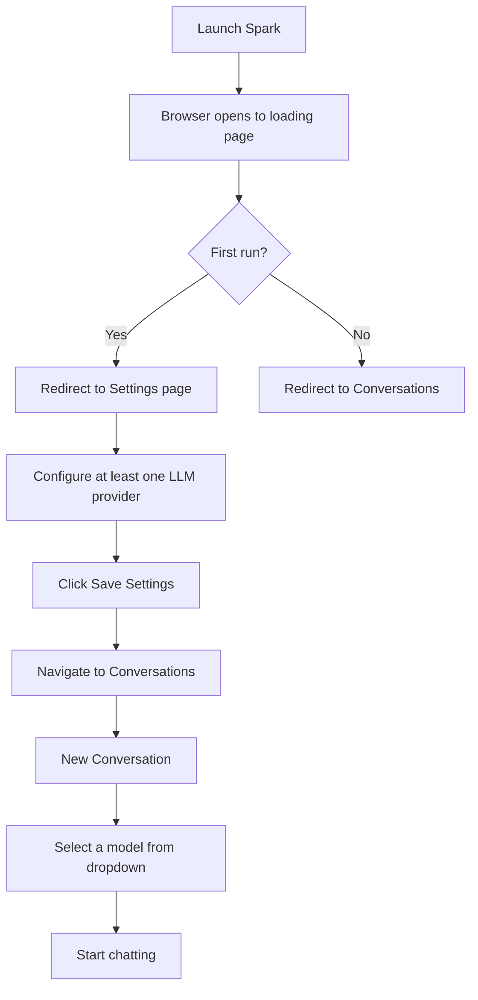
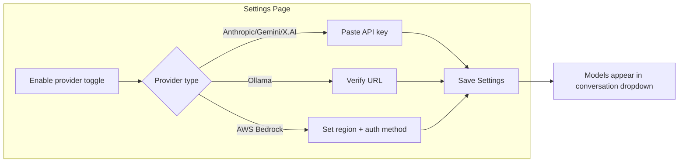

# Getting Started with Spark

This guide covers every supported installation method, first-run configuration, and upgrading.

---

## Prerequisites

- **Python 3.12 or later** is required for pip-based installation.
- A modern web browser (Chrome, Firefox, Safari, Edge) for the web UI.
- At least one LLM provider API key or a running Ollama instance.

---

## 1. Install via pip

The simplest path if you already have a Python environment.

```bash
pip install cognisn-spark
```

Then launch:

```bash
spark
```

Spark starts a local web server and opens your browser automatically.

### Optional database drivers

By default Spark uses SQLite, which requires no additional packages. For other databases, install the corresponding driver:

| Database   | Install command                            |
|------------|--------------------------------------------|
| MySQL      | `pip install cognisn-spark[mysql]`         |
| PostgreSQL | `pip install cognisn-spark[postgresql]`    |
| MSSQL      | `pip install cognisn-spark[mssql]`         |
| All        | `pip install cognisn-spark[all-databases]` |

You can combine extras:

```bash
pip install cognisn-spark[mysql,postgresql]
```

### Verifying installation

```bash
spark --version
```

Or if running from the source package:

```bash
python -m spark.launch
```

---

## 2. macOS DMG

Available for both **ARM64** (Apple Silicon -- M1/M2/M3/M4) and **x86_64** (Intel) architectures. The DMG is code-signed with a Developer ID certificate and notarized by Apple.

### Step by step

1. **Download** the `.dmg` file for your architecture from the [Releases](https://github.com/Cognisn/spark/releases) page.

2. **Open** the DMG by double-clicking. Drag the **Spark** icon into the **Applications** folder.

3. **Launch Spark**. Double-click Spark in Applications. The app is notarized by Apple, so it should open without any Gatekeeper warnings.

   > **Troubleshooting**: If macOS shows a warning that "Spark can't be opened", this means the notarization ticket was not stapled to this build. In that case:
   > - Right-click (or Control-click) on Spark in Applications and choose **Open**. Click **Open** again to confirm.
   > - Or go to **System Settings > Privacy & Security**, scroll down, and click **Open Anyway**.
   > - Or run `xattr -cr /Applications/Spark.app` in Terminal to remove the quarantine attribute.

4. On first launch, a splash screen appears while the Python runtime is extracted and dependencies are downloaded from PyPI. This takes 30-60 seconds and requires an internet connection. Subsequent launches start in a few seconds.

5. Your browser opens to the Spark loading screen, then redirects to the UI when ready.

---

## 3. Windows NSIS Installer

### Step by step

1. **Download** the `Spark-<version>-windows-x86_64-setup.exe` from the [Releases](https://github.com/Cognisn/spark/releases) page.

2. **Run the installer**. Follow the setup wizard. The default install location is:

   ```
   C:\Program Files\Cognisn\Spark
   ```

3. The installer creates:
   - A **desktop shortcut**
   - A **Start Menu** entry under Cognisn > Spark

4. **Launch** from the desktop shortcut or Start Menu.

5. On first launch, a splash screen appears while the Python runtime is extracted and dependencies are downloaded from PyPI. This takes 30-60 seconds and requires an internet connection. Subsequent launches start in a few seconds.

6. Your browser opens to the Spark UI.

7. **Windows Firewall**: on first launch Windows may ask whether to allow Spark to communicate on the network. Choose **Allow access** -- Spark needs this to serve its local web UI and to reach LLM provider APIs.

---

## 4. Linux

Linux users install via pip (see section 1 above). Pre-built binaries are not currently available for Linux. Any desktop Linux distribution with Python 3.12+ and a web browser is supported.

---

## 5. First-Run Configuration

After launching Spark for the first time, the following flow applies regardless of installation method.

### First-run flow



### Required: configure at least one LLM provider

On the Settings page you must enable and configure at least one provider before you can start a conversation.

#### Anthropic (Claude)

1. Go to [console.anthropic.com](https://console.anthropic.com/) and generate an API key.
2. In Spark Settings, enable the **Anthropic** provider.
3. Paste your API key into the **API Key** field.

#### Google Gemini

1. Go to [aistudio.google.com](https://aistudio.google.com/) and generate an API key.
2. In Spark Settings, enable the **Google Gemini** provider.
3. Paste your API key into the **API Key** field.

#### Ollama (local models)

1. Install and start [Ollama](https://ollama.com/) on your machine.
2. In Spark Settings, enable the **Ollama** provider.
3. The default URL `http://localhost:11434` is pre-filled. Change it only if Ollama runs on a different host or port.
4. No API key is needed.

#### AWS Bedrock

1. In Spark Settings, enable the **AWS Bedrock** provider.
2. Set the **Region** (e.g. `us-east-1`).
3. Choose an authentication method:
   - **SSO** -- uses your configured AWS SSO profile.
   - **IAM** -- provide an access key ID and secret access key.

#### X.AI (Grok)

1. Obtain an API key from X.AI.
2. In Spark Settings, enable the **X.AI** provider.
3. Paste your API key into the **API Key** field.

### Save and start

1. Click **Save Settings**.
2. Navigate to **Conversations** using the sidebar.
3. Click **New Conversation**.
4. Select a model from the dropdown at the top of the conversation.
5. Type a message and press Enter.

### Optional recommended settings

- **Default Model** -- in Settings under **Default Model**, pick the model you use most often. New conversations will pre-select it.
- **Filesystem access** -- if you want the AI to read or write files on your system, go to Settings and add paths under **Filesystem > Allowed Paths**. Only the listed directories (and their children) will be accessible to file tools.

### Provider configuration flow



---

## 7. Upgrading

### pip

```bash
pip install --upgrade cognisn-spark
```

Then restart Spark. Your conversations and settings are preserved.

### macOS DMG

1. Download the new DMG from the Releases page.
2. Open the DMG and drag Spark to Applications, replacing the existing copy.
3. Launch Spark. The launcher auto-detects the upgrade and runs any necessary migrations.

### Windows installer

1. Download and run the new setup executable.
2. The installer clears the PyApp cache automatically and replaces the previous installation.
3. Launch Spark from the desktop shortcut or Start Menu as usual.

### Linux (pip)

```bash
pip install --upgrade cognisn-spark
```

### Auto-update notifications

Spark checks for new versions in the background. When an update is available:

1. A notification badge appears on the **Help** menu in the web UI.
2. A modal displays on the dashboard showing the current and latest version with rendered release notes.
3. Click **Download Update** to open the GitHub releases page where you can download the new installer for your platform.

---

## Navigation

The web interface has the following sections:

| Page | Description |
|------|-------------|
| **Home** | Dashboard with recent conversations, provider status, and tool overview |
| **Conversations** | List, search, create, and manage conversations |
| **Memories** | View and manage persistent memories |
| **Actions** | Configure autonomous scheduled AI tasks (if enabled) |
| **Settings** | Application configuration |
| **Help** | Built-in user guide with searchable topics |

### Keyboard Shortcuts

| Shortcut | Action |
|----------|--------|
| Ctrl/Cmd + K | Go to Conversations |
| Ctrl/Cmd + N | New Conversation |
| Ctrl/Cmd + , | Open Settings |
| Enter | Send message (in chat) |
| Shift + Enter | New line in message |
| Escape | Close modal/dialog |

---

## Next Steps

- [Configuration Reference](configuration.md) -- Full config.yaml documentation
- [Providers](providers.md) -- Detailed provider setup for each LLM
- [Tools](tools.md) -- Built-in and MCP tool configuration
- [Memory](memory.md) -- Persistent memory system
