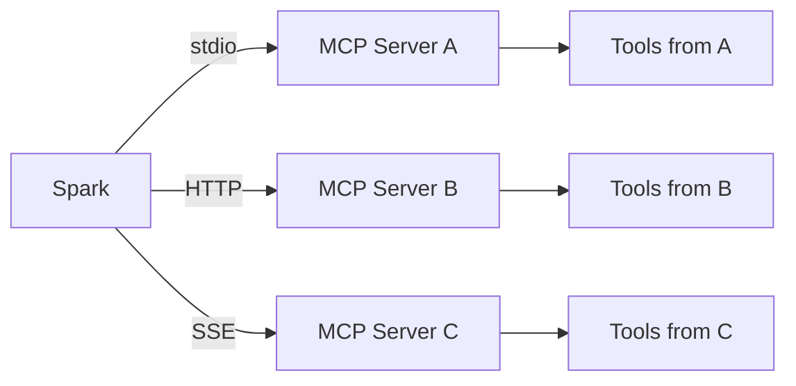

# MCP Integration

Spark supports the [Model Context Protocol (MCP)](https://modelcontextprotocol.io/) for connecting external tool servers. MCP tools appear alongside built-in tools and can be used in any conversation.

## Overview



## Transport Types

MCP servers can be connected using three transport methods:

### stdio

The server runs as a child process. Spark launches the command and communicates over standard input/output.

```yaml
mcp:
  servers:
    - name: filesystem-server
      transport: stdio
      command: npx
      args: ["-y", "@modelcontextprotocol/server-filesystem", "/path/to/allowed"]
```

### HTTP (Streamable HTTP)

The server runs as an HTTP service. Spark connects to the URL and uses the streamable HTTP transport.

```yaml
mcp:
  servers:
    - name: remote-server
      transport: http
      url: https://mcp.example.com/api
      auth_type: bearer
      auth_token: secret://mcp_remote_token
```

### SSE (Server-Sent Events)

The server runs as an SSE endpoint. This is the legacy MCP transport method.

```yaml
mcp:
  servers:
    - name: sse-server
      transport: sse
      url: https://mcp.example.com/sse
```

## Adding a Server via the UI

1. Go to **Settings > Tools > MCP Servers**
2. Click **Add Server**
3. Fill in the configuration:
   - **Name** -- Unique identifier for the server
   - **Transport** -- stdio, HTTP, or SSE
   - **Command/Args** (stdio) or **URL** (HTTP/SSE)
   - **Environment variables** (stdio) -- passed to the child process
   - **Authentication** -- none, bearer token, API key, basic auth, or custom headers
   - **Timeout** -- Connection timeout in seconds (default: 30)
   - **SSL Verify** -- Whether to verify TLS certificates (default: true)
4. Click **Test Connection** to verify the server is reachable
5. Click **Save**

The server connects immediately and its tools become available in all conversations.

## Adding a Server via config.yaml

```yaml
mcp:
  servers:
    - name: my-server
      transport: stdio
      command: npx
      args: ["-y", "@example/mcp-server"]
      env:
        API_KEY: secret://example_api_key
      timeout: 30

    - name: remote-tools
      transport: http
      url: https://tools.example.com/mcp
      auth_type: bearer
      auth_token: secret://remote_bearer_token
      ssl_verify: true
      timeout: 60
```

Servers configured in `config.yaml` are automatically connected on startup.

## Authentication

MCP servers can require authentication. Spark supports multiple auth methods:

| Auth Type | Description | Config Fields |
|-----------|-------------|---------------|
| `none` | No authentication | (none) |
| `bearer` | Bearer token in Authorization header | `auth_token` |
| `api_key` | API key in a custom header | `auth_token`, `auth_header_name` (default: X-API-Key) |
| `basic` | HTTP Basic Authentication | `basic_username`, `basic_password` |
| `custom` | Custom headers | `custom_headers` (dict) |

Example with API key authentication:

```yaml
mcp:
  servers:
    - name: secured-server
      transport: http
      url: https://api.example.com/mcp
      auth_type: api_key
      auth_token: secret://server_api_key
      auth_header_name: X-API-Key
```

## Per-Conversation Control

Each conversation can enable or disable specific MCP servers and tools:

1. Open a conversation and click the gear icon
2. Go to the **Tools** tab
3. Toggle MCP servers or individual tools on/off

Changes take effect immediately for subsequent messages. This is stored in the `conversation_mcp_servers` and `conversation_embedded_tools` database tables.

## Tool Discovery

When an MCP server connects, Spark:

1. Calls `list_tools()` on the server
2. Caches the tool definitions (name, description, input schema)
3. Merges them with built-in tools for the model

The tool cache is refreshed when:

- A server reconnects
- You click **Refresh** in the MCP server settings
- The cache is explicitly invalidated

## Tool Execution

When the AI calls an MCP tool:

1. Spark identifies which server owns the tool
2. Calls the tool on that server with the provided arguments
3. Extracts text content from the response
4. Returns the result to the AI
5. Records the transaction in the `mcp_transactions` table

MCP tool execution respects the server's configured timeout. If a tool call exceeds the timeout, it returns an error.

## Troubleshooting

### Server fails to connect

- **stdio:** Verify the command is installed and accessible (`which npx`, `which node`, etc.)
- **HTTP/SSE:** Verify the URL is reachable and the server is running
- Check the Spark log files for detailed error messages
- Ensure environment variables are correctly set (especially for secret:// URIs)

### Tools not appearing

- Verify the server is connected (green status indicator in Settings)
- Click **Refresh** to re-discover tools
- Check that the server actually exposes tools via `list_tools()`

### SSL errors

- Set `ssl_verify: false` for servers with self-signed certificates
- Ensure the CA certificate is trusted by the system
