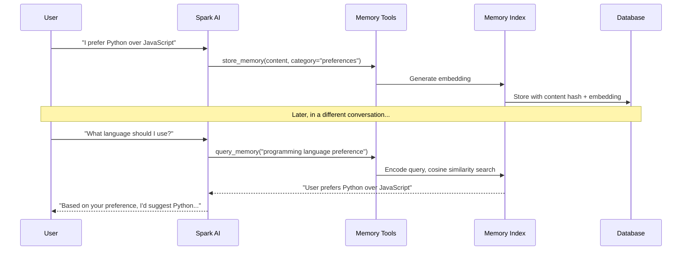

# Memory System

Spark includes a persistent memory system that stores information across conversations. The AI can proactively remember facts, preferences, and context, and automatically retrieves relevant memories when responding.

## How It Works



## Memory Categories

Each memory is assigned a category:

| Category | Purpose | Examples |
|----------|---------|----------|
| **preferences** | User preferences and settings | "Prefers dark mode", "Uses VS Code" |
| **facts** | Factual information | "Works at Acme Corp", "Lives in London" |
| **projects** | Project context and decisions | "Spark uses FastAPI for the backend" |
| **instructions** | Standing instructions for the AI | "Always use British English" |
| **relationships** | People, organisations, connections | "Alice is the team lead" |

## Memory Tools

The AI has four memory tools:

### store_memory

Stores a new memory with content, category, and optional importance score (0.0 to 1.0, default: 0.5). Duplicate content is automatically detected via content hashing and rejected.

### query_memory

Searches memories by semantic similarity using vector embeddings. Returns the top-k most relevant memories above a similarity threshold. Can optionally filter by category.

### list_memories

Lists all stored memories, optionally filtered by category. Returns up to 50 memories with their IDs, categories, and content.

### delete_memory

Deletes a specific memory by its ID.

## Proactive Memory

The AI is instructed to proactively store memories when users share:

- Personal information or preferences
- Project details and decisions
- Instructions or constraints
- Relationships and connections

You do not need to explicitly ask the AI to remember things -- it will use `store_memory` automatically when appropriate.

## Auto-Retrieval

When you send a message, Spark automatically:

1. Encodes your message using the embedding model
2. Searches stored memories for semantic matches
3. Injects relevant memories into the system prompt as context

This happens transparently before the AI generates its response.

### Configuration

Auto-retrieval settings are part of the memory index:

- **enabled:** Whether auto-retrieval is active (default: true)
- **top_k:** Number of memories to retrieve (default: 5)
- **threshold:** Minimum similarity score (default: 0.4)

## Embedding Model

Memories use [sentence-transformers](https://www.sbert.net/) for generating vector embeddings:

- **Default model:** all-MiniLM-L6-v2
- **Device:** CPU (configurable)
- **Lazy loading:** The model is only downloaded on first use
- **Thread-safe:** Multiple components share a single model instance

## Managing Memories via the UI

The **Memories** page provides:

- **List view** with category badges and importance scores
- **Category filter** to view memories by type
- **Edit** individual memories (content, category, importance)
- **Delete** individual memories
- **Bulk delete** (type DELETE_ALL to confirm)
- **Import** memories from a JSON file
- **Export** all memories as JSON
- **Statistics** showing total count, breakdown by category, and average importance

## Import/Export Format

Memories are exported as a JSON array:

```json
[
  {
    "content": "User prefers Python over JavaScript",
    "category": "preferences",
    "importance": 0.7,
    "created_at": "2026-03-15T10:30:00Z"
  }
]
```

When importing, each memory is stored with a new embedding. Duplicates (by content hash) are skipped.

## Database Storage

Memories are stored in the `user_memories` table:

| Column | Type | Description |
|--------|------|-------------|
| id | INTEGER | Primary key |
| user_guid | TEXT | Owner identifier |
| content | TEXT | Memory text |
| category | TEXT | Category name |
| content_hash | TEXT | SHA-256 hash for deduplication |
| embedding | BLOB | Vector embedding (float32 array) |
| importance | REAL | Importance score (0.0 to 1.0) |
| created_at | TIMESTAMP | Creation time |
| last_accessed | TIMESTAMP | Last retrieval time |
| source_conversation_id | INTEGER | Conversation where the memory was created |
| metadata_json | TEXT | Optional metadata |
