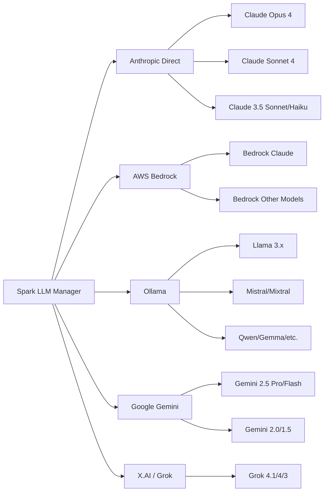

# LLM Providers

Spark supports five LLM providers. You can enable multiple providers simultaneously and switch between their models per conversation.

## Provider Overview



## Anthropic (Direct API)

Direct access to Claude models via the Anthropic SDK.

### Obtaining an API Key

1. Visit the [Anthropic Console](https://console.anthropic.com/) and click **Sign Up**. You can register with an email address or use Google/GitHub SSO.
2. Complete email verification and sign in.
3. Navigate to **Settings → Billing** and add a payment method. API access requires an active billing profile (Anthropic may provide free trial credits for new accounts).
4. Go to **Settings → API Keys** and click **Create Key**.
5. Give the key a descriptive name (e.g. "Spark") and copy it immediately — Anthropic will not display the full key again.

> **Tip:** Store the key somewhere safe before closing the dialog. If you lose it, you will need to create a new one.

### Configuring in Spark

1. In Spark, go to **Settings → LLM Providers → Anthropic** and toggle **Enabled** on.
2. Paste your API key into the **API Key** field.
3. Click **Save Settings**.
4. Create a new conversation, select a Claude model, and send a test message to verify.

### Configuration

```yaml
providers:
  anthropic:
    enabled: true
    api_key: secret://anthropic_api_key
```

### Troubleshooting

- **401 Authentication error** — Check that the API key is correct and has not been revoked. Ensure there are no leading or trailing spaces.
- **Insufficient credits / billing error** — Visit the Anthropic Console billing page and ensure a valid payment method is on file.
- **429 Rate limit exceeded** — You have exceeded your usage tier limits. Wait and retry, or upgrade your tier in the Console.

### Available Models

| Model | Context Window | Max Output | Tool Support |
|-------|---------------|------------|--------------|
| Claude Opus 4 | 200,000 | 32,000 | Yes |
| Claude Sonnet 4 | 200,000 | 32,000 | Yes |
| Claude 3.7 Sonnet | 200,000 | 32,000 | Yes |
| Claude 3.5 Sonnet | 200,000 | 8,192 | Yes |
| Claude 3.5 Haiku | 200,000 | 8,192 | Yes |
| Claude 3 Opus | 200,000 | 4,096 | Yes |
| Claude 3 Haiku | 200,000 | 4,096 | Yes |

### Features

- Streaming responses (token-by-token)
- Full tool/function calling support
- Rate limit retry with exponential backoff

## AWS Bedrock

Access Claude and other models through AWS infrastructure using existing AWS credentials.

### Setting Up AWS Bedrock Access

1. Sign in to the [AWS Management Console](https://console.aws.amazon.com/). If you do not have an account, click **Create an AWS Account** and follow the registration process.
2. Search for **Bedrock** in the services search bar, or navigate to **Services → Machine Learning → Amazon Bedrock**. Note: Bedrock is not available in all regions — ensure you are in a supported region (e.g. `us-east-1`, `us-west-2`, `eu-west-1`).
3. In the Bedrock console, go to **Model access** in the left sidebar and click **Manage model access**.
4. Tick the checkbox next to each desired model (e.g. Anthropic Claude models) and click **Request model access**. Most Anthropic models are approved instantly.

### Authentication Methods

Spark supports three authentication methods for Bedrock:

#### SSO (Recommended for Organisations)

If your organisation uses AWS IAM Identity Centre:

1. Run `aws configure sso` in your terminal and follow the prompts.
2. In Spark settings, set **Auth Method** to `sso` and optionally enter your **SSO Profile** name.

#### IAM (Access Keys)

For IAM users with programmatic access:

1. In the AWS Console, create an IAM user (or use an existing one) with Bedrock permissions.
2. The IAM user or role needs at minimum the `bedrock:InvokeModel` and `bedrock:InvokeModelWithResponseStream` permissions.
3. Generate an access key pair for the user in **IAM → Users → Security credentials**.
4. In Spark settings, set **Auth Method** to `iam` and enter the **Access Key ID** and **Secret Access Key**.

#### Session (Temporary Credentials)

For short-lived access using temporary credentials:

1. Obtain temporary credentials via `aws sts get-session-token` or your organisation's credential vending process.
2. In Spark settings, set **Auth Method** to `session` and enter the **Access Key ID**, **Secret Access Key**, and **Session Token**.

> **Tip:** You can verify your AWS CLI credentials work by running `aws bedrock list-foundation-models --region us-east-1`. If you see a list of models, your credentials are configured correctly.

### Configuring in Spark

1. In Spark, go to **Settings → LLM Providers → AWS Bedrock** and toggle **Enabled** on.
2. Enter the AWS region where you enabled model access (e.g. `us-east-1`).
3. Select the authentication method and provide the corresponding credentials.
4. Click **Save Settings**.
5. Create a new conversation — Bedrock models should appear in the model picker.

### Configuration

```yaml
providers:
  aws_bedrock:
    enabled: true
    region: us-east-1
    auth_method: sso             # sso, iam, or session
    profile: default             # Optional — for SSO auth method
    # For iam/session auth methods, credentials are stored in the OS keychain:
    # access_key: secret://aws_bedrock_access_key
    # secret_key: secret://aws_bedrock_secret_key
    # session_token: secret://aws_bedrock_session_token  # session method only
```

### Troubleshooting

- **No models appear** — Ensure you have requested and been granted model access in the Bedrock console. Verify the region in Spark matches the region where you enabled access.
- **Access denied / credential errors** — Run `aws sts get-caller-identity` to verify your credentials. For SSO, run `aws sso login` to refresh your session.
- **Timeout** — Check your network connection and ensure outbound HTTPS to AWS endpoints is not blocked.

### Available Models

Models are listed dynamically from the Bedrock API based on what is enabled in your AWS account and region. Claude models accessed via Bedrock support tool use.

## Ollama (Local Models)

Run models locally using [Ollama](https://ollama.com). No API key or cloud account needed — everything stays on your machine.

### Installing Ollama

1. Visit [ollama.com](https://ollama.com) and download the installer for your operating system. On macOS, you can also install via Homebrew: `brew install ollama`.
2. Run the installer. On macOS, drag Ollama to your Applications folder. On first launch, Ollama installs its CLI tools and starts the background service.
3. Pull a model by running one of these commands in your terminal:
   - `ollama pull llama3.3` — Meta's Llama 3.3 (good general purpose, ~4 GB)
   - `ollama pull qwen3` — Alibaba's Qwen 3 (strong reasoning, ~5 GB)
   - `ollama pull mistral` — Mistral 7B (fast, lightweight, ~4 GB)
   - `ollama pull gemma3` — Google's Gemma 3 (efficient, ~3 GB)
4. Verify installation by running `ollama list` to see your downloaded models.

> **Tip:** Browse the full model library at [ollama.com/library](https://ollama.com/library) to find models suited to your use case and hardware. You will need sufficient RAM (8 GB minimum, 16 GB+ recommended) and disk space for model files.

### Configuring in Spark

1. In Spark, go to **Settings → LLM Providers → Ollama** and toggle **Enabled** on.
2. The default URL `http://localhost:11434` is correct for a standard local installation. Only change this if Ollama is running on a different machine or port.
3. Click **Save Settings**.
4. Create a new conversation — your locally downloaded models should appear in the model picker.

### Configuration

```yaml
providers:
  ollama:
    enabled: true
    base_url: http://localhost:11434
```

### Troubleshooting

- **Connection refused** — Ensure Ollama is running. On macOS, check for the Ollama icon in the menu bar. Start manually with `ollama serve`.
- **No models appear** — Pull at least one model first: `ollama pull llama3.3`.
- **Slow performance** — Larger models need more RAM and compute. Try a smaller model or close other resource-heavy applications.

### Available Models

Models are listed dynamically from the running Ollama server. Common models and their approximate context windows:

| Model Family | Context Window | Tool Support |
|-------------|---------------|--------------|
| Llama 3.x | 128,000 | Yes |
| Mistral / Mixtral | 32,768 | Yes |
| Qwen 2 | 128,000 | Yes |
| CodeLlama | 16,384 | Limited |
| Gemma | 8,192 | Limited |

Tool support depends on the specific model. Larger models generally provide better tool-use capabilities.

### Tips

- Use `ollama list` to see downloaded models
- Pull new models with `ollama pull <model-name>`
- For remote Ollama servers, change `base_url` to point to the host

## Google Gemini

Access Google's Gemini models via the Google AI API.

### Obtaining an API Key

1. Visit [Google AI Studio](https://aistudio.google.com/) and sign in with your Google account (personal Gmail or Google Workspace). Accept the terms of service if prompted.
2. Click **Get API key** in the left sidebar or top navigation.
3. Click **Create API key**. You may be asked to select or create a Google Cloud project — the default project is fine for personal use.
4. Copy the generated API key. You can always return to this page to view or regenerate keys.

> **Tip:** The Gemini API has a generous free tier. Check the [pricing page](https://ai.google.dev/gemini-api/docs/pricing) for current rate limits and quotas.

### Configuring in Spark

1. In Spark, go to **Settings → LLM Providers → Google Gemini** and toggle **Enabled** on.
2. Paste the API key into the **API Key** field.
3. Click **Save Settings**.
4. Create a new conversation, select a Gemini model, and send a test message to verify.

### Configuration

```yaml
providers:
  google_gemini:
    enabled: true
    api_key: secret://google_gemini_api_key
```

### Troubleshooting

- **400 / API key not valid** — Ensure the key was copied correctly with no extra spaces. Newly created keys may take a minute to propagate.
- **429 Quota exceeded** — You have hit the free-tier rate limit. Wait a minute before retrying.
- **Model not available** — Some Gemini models may have regional restrictions. Check the [Google AI documentation](https://ai.google.dev/gemini-api/docs) for availability.

### Available Models

| Model | Context Window | Max Output | Tool Support |
|-------|---------------|------------|--------------|
| Gemini 2.5 Pro | 1,000,000 | 65,536 | Yes |
| Gemini 2.5 Flash | 1,000,000 | 65,536 | Yes |
| Gemini 2.0 Flash | 1,000,000 | 8,192 | Yes |
| Gemini 1.5 Pro | 2,000,000 | 8,192 | Yes |
| Gemini 1.5 Flash | 1,000,000 | 8,192 | Yes |

Spark attempts to list models dynamically from the API and falls back to the built-in list if the API call fails.

### Features

- Streaming responses
- Tool/function calling
- Rate limit retry with exponential backoff

## X.AI (Grok)

Access X.AI's Grok models via their OpenAI-compatible API.

### Obtaining an API Key

1. Visit the [X.AI Console](https://console.x.ai/) and sign up. You can register using your X (Twitter) account or with an email address.
2. Navigate to the billing section and add a payment method. API access requires active billing (X.AI may offer free credits for new accounts).
3. Find the **API Keys** section in the dashboard or account settings.
4. Click **Create API Key**, give it a descriptive name (e.g. "Spark"), and copy the key immediately — it is only shown once.

### Configuring in Spark

1. In Spark, go to **Settings → LLM Providers → X.AI** and toggle **Enabled** on.
2. Paste the API key into the **API Key** field.
3. Click **Save Settings**.
4. Create a new conversation, select a Grok model, and send a test message to verify.

### Configuration

```yaml
providers:
  xai:
    enabled: true
    api_key: secret://xai_api_key
```

### Troubleshooting

- **401 Authentication error** — Verify the API key is correct and has not been revoked.
- **Model not found** — X.AI may update available models. Check the [X.AI documentation](https://docs.x.ai/docs/overview) for the current list.
- **Billing error** — Ensure your billing information is current and you have sufficient credits.

### Available Models

| Model | Context Window | Max Output | Tool Support |
|-------|---------------|------------|--------------|
| Grok 4.1 Fast | 2,000,000 | 131,072 | Yes |
| Grok 4 | 256,000 | 16,384 | Yes |
| Grok 3 | 131,072 | 8,192 | Yes |
| Grok 3 Mini | 131,072 | 8,192 | Yes |

## Switching Models

You can switch the model used in a conversation at any time by clicking the model name in the chat header. The model dropdown shows all models from all enabled providers.

When creating a new conversation, if a `default_model` is configured, it will be pre-selected:

```yaml
default_model:
  model_id: gemini-2.5-flash
  mode: default                  # default = pre-selected, mandatory = locked
```

Set `mode: mandatory` to lock all new conversations to the specified model.

## Context Limits

Spark maintains built-in context window and max output limits for known model families. You can override these in the config:

```yaml
context_limits:
  claude-sonnet-4-20250514:
    context_window: 200000
    max_output: 16384
  my-custom-model:
    context_window: 32768
    max_output: 8192
```

The resolution order is: exact config match, partial config match, built-in defaults, then a global fallback of 8,192 context / 4,096 output.

## Prompt Caching

Spark supports prompt caching to reduce input token costs. When enabled (default: on), the system prompt and tool definitions are cached so that repeated requests in a conversation reuse the cached prefix rather than re-processing it.

### Provider Support

| Provider | Caching Method | How It Works |
|----------|---------------|--------------|
| **Anthropic** | `cache_control` blocks | System prompt and tool definitions are marked with `cache_control: {type: "ephemeral"}`. Anthropic caches the prefix automatically; cached tokens are billed at 90% discount. |
| **Google Gemini** | Context caching API | A `CachedContent` object is created containing the system prompt and tools (5-minute TTL). Subsequent requests reference the cache by name, reducing input processing. |
| **AWS Bedrock** | Not supported | Bedrock's Converse API does not expose prompt caching. |
| **Ollama** | Not supported | Local inference; no caching API. |
| **X.AI (Grok)** | Not supported | OpenAI-compatible API without caching extensions. |

### Configuration

Global setting in `config.yaml`:

```yaml
conversation:
  prompt_caching: true    # Default: on
```

Or toggle in **Settings > Conversation > Prompt Caching**.

Each conversation can override the global setting via its settings panel (gear icon > Context tab > Prompt caching toggle).

### Cost Impact

For Anthropic, prompt caching can reduce input costs significantly:
- **Without caching**: Full system prompt + tools sent with every request (~2,000-5,000 tokens)
- **With caching**: Cached tokens billed at ~10% of normal input cost after first request
- **Savings**: Up to 90% reduction on system prompt tokens for multi-turn conversations
