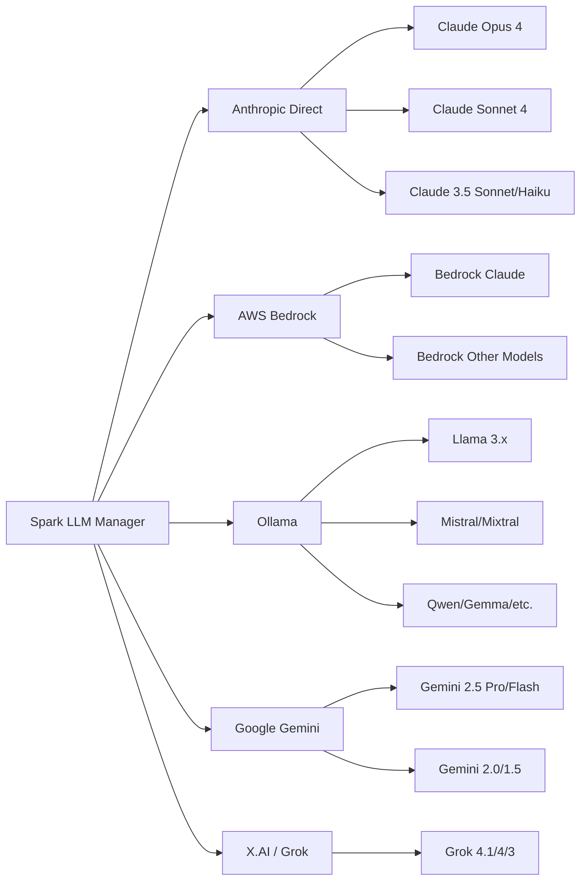

# LLM Providers

Spark supports five LLM providers. You can enable multiple providers simultaneously and switch between their models per conversation.

## Provider Overview



## Anthropic (Direct API)

Direct access to Claude models via the Anthropic SDK.

### Setup

1. Get an API key from [anthropic.com](https://www.anthropic.com)
2. In Spark **Settings > Providers > Anthropic**, enable the provider and enter the API key

### Configuration

```yaml
providers:
  anthropic:
    enabled: true
    api_key: secret://anthropic_api_key
```

### Available Models

| Model | Context Window | Max Output | Tool Support |
|-------|---------------|------------|--------------|
| Claude Opus 4 | 200,000 | 32,000 | Yes |
| Claude Sonnet 4 | 200,000 | 32,000 | Yes |
| Claude 3.7 Sonnet | 200,000 | 32,000 | Yes |
| Claude 3.5 Sonnet | 200,000 | 8,192 | Yes |
| Claude 3.5 Haiku | 200,000 | 8,192 | Yes |
| Claude 3 Opus | 200,000 | 4,096 | Yes |
| Claude 3 Haiku | 200,000 | 4,096 | Yes |

### Features

- Streaming responses (token-by-token)
- Full tool/function calling support
- Rate limit retry with exponential backoff

## AWS Bedrock

Access Claude and other models through AWS infrastructure using existing AWS credentials.

### Setup

1. Ensure you have AWS credentials configured (SSO, IAM, or session)
2. Enable Claude model access in the AWS Bedrock console for your region
3. In Spark **Settings > Providers > AWS Bedrock**, enable the provider

### Configuration

```yaml
providers:
  aws_bedrock:
    enabled: true
    region: us-east-1
    auth_method: sso             # sso, iam, or session
    profile: default             # Optional — for SSO auth method
    # For iam/session auth methods, credentials are stored in the OS keychain:
    # access_key: secret://aws_bedrock_access_key
    # secret_key: secret://aws_bedrock_secret_key
    # session_token: secret://aws_bedrock_session_token  # session method only
```

### Authentication

Three authentication methods are supported:

- **SSO:** Configure via `aws sso login` — set the `profile` to your SSO profile name. Recommended for organisations using AWS IAM Identity Centre.
- **IAM:** Enter an Access Key ID and Secret Access Key directly in the settings UI. Credentials are stored in the OS keychain. The IAM user needs `bedrock:InvokeModel` and `bedrock:InvokeModelWithResponseStream` permissions.
- **Session:** Enter an Access Key ID, Secret Access Key, and Session Token for temporary credentials.

### Available Models

Models are listed dynamically from the Bedrock API based on what is enabled in your AWS account and region. Claude models accessed via Bedrock support tool use.

## Ollama (Local Models)

Run models locally using [Ollama](https://ollama.com). No API key needed.

### Setup

1. Install Ollama from [ollama.com](https://ollama.com)
2. Pull a model: `ollama pull llama3.3`
3. Ensure Ollama is running (it starts automatically on install)
4. In Spark **Settings > Providers > Ollama**, enable the provider

### Configuration

```yaml
providers:
  ollama:
    enabled: true
    base_url: http://localhost:11434
```

### Available Models

Models are listed dynamically from the running Ollama server. Common models and their approximate context windows:

| Model Family | Context Window | Tool Support |
|-------------|---------------|--------------|
| Llama 3.x | 128,000 | Yes |
| Mistral / Mixtral | 32,768 | Yes |
| Qwen 2 | 128,000 | Yes |
| CodeLlama | 16,384 | Limited |
| Gemma | 8,192 | Limited |

Tool support depends on the specific model. Larger models generally provide better tool-use capabilities.

### Tips

- Use `ollama list` to see downloaded models
- Pull new models with `ollama pull <model-name>`
- For remote Ollama servers, change `base_url` to point to the host

## Google Gemini

Access Google's Gemini models via the Google AI API.

### Setup

1. Get an API key from [Google AI Studio](https://aistudio.google.com/apikey)
2. In Spark **Settings > Providers > Google Gemini**, enable the provider and enter the API key

### Configuration

```yaml
providers:
  google_gemini:
    enabled: true
    api_key: secret://google_gemini_api_key
```

### Available Models

| Model | Context Window | Max Output | Tool Support |
|-------|---------------|------------|--------------|
| Gemini 2.5 Pro | 1,000,000 | 65,536 | Yes |
| Gemini 2.5 Flash | 1,000,000 | 65,536 | Yes |
| Gemini 2.0 Flash | 1,000,000 | 8,192 | Yes |
| Gemini 1.5 Pro | 2,000,000 | 8,192 | Yes |
| Gemini 1.5 Flash | 1,000,000 | 8,192 | Yes |

Spark attempts to list models dynamically from the API and falls back to the built-in list if the API call fails.

### Features

- Streaming responses
- Tool/function calling
- Rate limit retry with exponential backoff

## X.AI (Grok)

Access X.AI's Grok models via their OpenAI-compatible API.

### Setup

1. Get an API key from [x.ai](https://x.ai)
2. In Spark **Settings > Providers > X.AI**, enable the provider and enter the API key

### Configuration

```yaml
providers:
  xai:
    enabled: true
    api_key: secret://xai_api_key
```

### Available Models

| Model | Context Window | Max Output | Tool Support |
|-------|---------------|------------|--------------|
| Grok 4.1 Fast | 2,000,000 | 131,072 | Yes |
| Grok 4 | 256,000 | 16,384 | Yes |
| Grok 3 | 131,072 | 8,192 | Yes |
| Grok 3 Mini | 131,072 | 8,192 | Yes |

## Switching Models

You can switch the model used in a conversation at any time by clicking the model name in the chat header. The model dropdown shows all models from all enabled providers.

When creating a new conversation, if a `default_model` is configured, it will be pre-selected:

```yaml
default_model:
  model_id: gemini-2.5-flash
  mode: default                  # default = pre-selected, mandatory = locked
```

Set `mode: mandatory` to lock all new conversations to the specified model.

## Context Limits

Spark maintains built-in context window and max output limits for known model families. You can override these in the config:

```yaml
context_limits:
  claude-sonnet-4-20250514:
    context_window: 200000
    max_output: 16384
  my-custom-model:
    context_window: 32768
    max_output: 8192
```

The resolution order is: exact config match, partial config match, built-in defaults, then a global fallback of 8,192 context / 4,096 output.

## Prompt Caching

Spark supports prompt caching to reduce input token costs. When enabled (default: on), the system prompt and tool definitions are cached so that repeated requests in a conversation reuse the cached prefix rather than re-processing it.

### Provider Support

| Provider | Caching Method | How It Works |
|----------|---------------|--------------|
| **Anthropic** | `cache_control` blocks | System prompt and tool definitions are marked with `cache_control: {type: "ephemeral"}`. Anthropic caches the prefix automatically; cached tokens are billed at 90% discount. |
| **Google Gemini** | Context caching API | A `CachedContent` object is created containing the system prompt and tools (5-minute TTL). Subsequent requests reference the cache by name, reducing input processing. |
| **AWS Bedrock** | Not supported | Bedrock's Converse API does not expose prompt caching. |
| **Ollama** | Not supported | Local inference; no caching API. |
| **X.AI (Grok)** | Not supported | OpenAI-compatible API without caching extensions. |

### Configuration

Global setting in `config.yaml`:

```yaml
conversation:
  prompt_caching: true    # Default: on
```

Or toggle in **Settings > Conversation > Prompt Caching**.

Each conversation can override the global setting via its settings panel (gear icon > Context tab > Prompt caching toggle).

### Cost Impact

For Anthropic, prompt caching can reduce input costs significantly:
- **Without caching**: Full system prompt + tools sent with every request (~2,000-5,000 tokens)
- **With caching**: Cached tokens billed at ~10% of normal input cost after first request
- **Savings**: Up to 90% reduction on system prompt tokens for multi-turn conversations
