# Tools

Spark provides the AI with a set of built-in tools and supports external tools via the Model Context Protocol (MCP). Tools allow the AI to read files, search the web, manage memories, and more.

## Tool Categories

```mermaid
graph TD
    Tools[All Tools]
    Tools --> Builtin[Built-in Tools]
    Tools --> MCP[MCP Server Tools]

    Builtin --> FS[Filesystem]
    Builtin --> Doc[Documents]
    Builtin --> Arc[Archives]
    Builtin --> Web[Web]
    Builtin --> Cmd[System Commands]
    Builtin --> Mem[Memory]
    Builtin --> DT[DateTime]
    Builtin --> TD[Tool Docs]

    FS --> read_file
    FS --> write_file
    FS --> list_directory
    FS --> search_files
    FS --> get_file_info
    FS --> find_in_file
    FS --> get_directory_tree

    Doc --> read_word
    Doc --> read_excel
    Doc --> read_pdf
    Doc --> read_powerpoint

    Arc --> list_archive
    Arc --> extract_archive

    Web --> web_search
    Web --> web_fetch

    Cmd --> run_command

    Mem --> store_memory
    Mem --> query_memory
    Mem --> list_memories
    Mem --> delete_memory

    DT --> get_current_datetime
    TD --> get_tool_documentation
```



## Built-in Tools

### DateTime

Always available. Returns the current date and time in any IANA timezone.

```
get_current_datetime(timezone="Europe/London", format="human")
```

- **timezone:** IANA timezone name (default: UTC)
- **format:** `iso` for ISO 8601 or `human` for readable format

### Filesystem

Requires `allowed_paths` to be configured. Tools are gated by mode: `read` (default) or `read_write`.

| Tool | Mode | Description |
|------|------|-------------|
| `read_file` | read | Read text file contents, optionally limited to N lines |
| `write_file` | read_write | Write text content to a file |
| `list_directory` | read | List files and directories, optionally recursive |
| `search_files` | read | Search for files matching a glob pattern |
| `get_file_info` | read | Get file metadata (size, type, modification time) |
| `find_in_file` | read | Search for text or regex within a file |
| `get_directory_tree` | read | Display a visual directory tree structure |

**Configuration:**

```yaml
embedded_tools:
  filesystem:
    enabled: true
    mode: read                   # read or read_write
    allowed_paths:
      - /Users/you/Documents
      - /Users/you/Projects
```

All file operations are restricted to paths within the `allowed_paths` list. This is a security boundary -- the AI cannot access files outside these directories.

### Documents

Reads common document formats. Requires `allowed_paths` to be configured (documents live on disk).

| Tool | Description |
|------|-------------|
| `read_word` | Extract text from .docx files |
| `read_excel` | Read data from .xlsx spreadsheets (optionally select sheet, limit rows) |
| `read_pdf` | Extract text from PDF files (optionally limit pages) |
| `read_powerpoint` | Extract text from .pptx presentations |

**Configuration:**

```yaml
embedded_tools:
  documents:
    enabled: true
    mode: read
    max_file_size_mb: 50
```

### Archives

List and optionally extract ZIP and TAR archives. Requires `allowed_paths` to be configured.

| Tool | Mode | Description |
|------|------|-------------|
| `list_archive` | list | List contents of a ZIP or TAR archive |
| `extract_archive` | extract | Extract files from an archive to a destination |

**Configuration:**

```yaml
embedded_tools:
  archives:
    enabled: true
    mode: list                   # list or extract
```

### Web

Search the web and fetch page content. No path configuration required.

| Tool | Description |
|------|-------------|
| `web_search` | Search the web using the configured engine |
| `web_fetch` | Fetch and convert a web page to readable text |

See [Web Search](web-search.md) for search engine configuration.

### System Commands

Execute shell commands on the host system. Disabled by default — must be explicitly enabled in Settings. OS-aware: uses zsh on macOS, bash on Linux, cmd.exe on Windows.

| Tool | Description |
|------|-------------|
| `run_command` | Execute a shell command, returning stdout and stderr |

**Configuration:**

```yaml
embedded_tools:
  system_commands:
    enabled: true
    timeout: 30                    # Default timeout per command (seconds)
    max_timeout: 300               # Maximum allowed timeout
    max_output_chars: 50000        # Truncate output beyond this
    blocked_commands: []            # Commands to block (e.g. rm, shutdown)
    require_approval: true         # Always prompt before running
```

**Security:**
- Disabled by default — must be explicitly enabled
- Dangerous commands (mkfs, fdisk, dd, format) are always blocked
- Configurable blocked command list for additional restrictions
- When `require_approval` is enabled (default), every command prompts for user approval
- Commands run under the same OS permissions as the Spark process
- Output is truncated to prevent excessive token usage

### Memory

Always available. Manages persistent cross-conversation memories.

| Tool | Description |
|------|-------------|
| `store_memory` | Store information with a category and importance score |
| `query_memory` | Search memories by semantic similarity |
| `list_memories` | List all memories, optionally filtered by category |
| `delete_memory` | Delete a specific memory by ID |

See [Memory](memory.md) for full details.

### Tool Documentation

Always available. The AI can retrieve detailed documentation for any tool before using it.

```
get_tool_documentation(tool_name="_index")    # Full tool index
get_tool_documentation(tool_name="read_file") # Specific tool docs
```

Documentation files are stored in `src/spark/resources/tool_docs/` as markdown files. Available documentation covers all built-in tools with parameters, return values, examples, and best practices.

## Tool Permissions

When the AI first uses a tool in a conversation, Spark prompts for permission:

- **Allow Once** -- Permit this single invocation
- **Always Allow** -- Approve this tool and all tools in the same category
- **Deny** -- Block the tool call

Permissions are stored per conversation in the database. When you approve a tool with "Always Allow", all tools in the same category are also approved. The categories are:

| Category | Tools |
|----------|-------|
| filesystem | read_file, write_file, list_directory, search_files, get_file_info, find_in_file, get_directory_tree |
| documents | read_word, read_excel, read_pdf, read_powerpoint |
| archives | list_archive, extract_archive |
| web | web_search, web_fetch |
| system_commands | run_command |
| memory | store_memory, query_memory, list_memories, delete_memory |
| core | get_current_datetime, get_tool_documentation |

To auto-approve all tools without prompting:

```yaml
tool_permissions:
  auto_approve: true
```

## Per-Conversation Tool Control

In any conversation's settings (gear icon), the **Tools** tab lets you:

- Enable or disable individual embedded tools
- Enable or disable entire MCP servers
- View which tools are currently active

This allows you to tailor tool availability for specific conversations.

## Tool Result Handling

Tool results are automatically:

1. **Truncated** if they exceed `max_tool_result_tokens * 4` characters
2. **Indexed** in the conversation's vector store for RAG retrieval
3. **Recorded** in the `mcp_transactions` table with execution time and error status
4. **Streamed** to the UI as real-time status events

## Tool Selection

When many tools are available (especially with multiple MCP servers), Spark uses intelligent tool selection to reduce the number of tool definitions sent to the model:

1. Analyses the user message for category keywords
2. Prioritises tools matching detected categories
3. Always includes utility tools (datetime)
4. Backfills remaining slots up to `max_tool_selections` (default: 30)

This reduces token usage from tool definitions while keeping relevant tools available.
