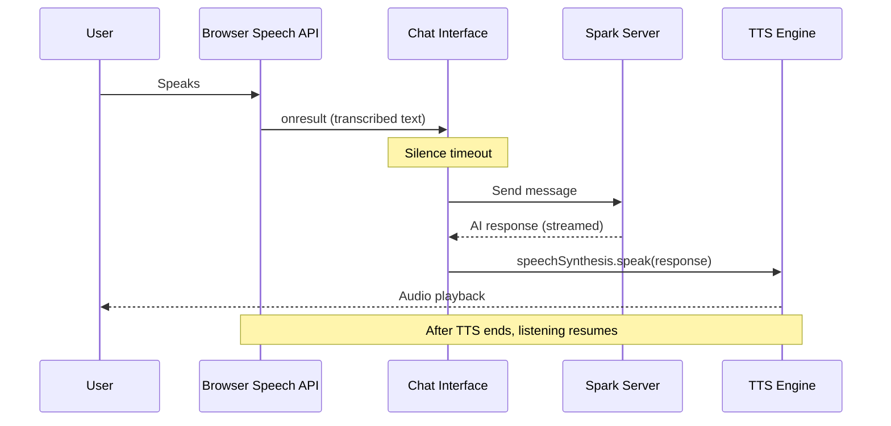

# Voice

Spark includes browser-based voice input and a full voice conversation mode using the Web Speech API.

## Requirements

Voice features require a browser that supports the Web Speech API:

- **Chrome / Edge** -- Full support (speech recognition and synthesis)
- **Safari** -- Speech recognition supported; synthesis supported
- **Firefox** -- Limited speech recognition support

The voice buttons are hidden if the browser does not support speech recognition.

## Speech-to-Text Input

The microphone button next to the message input provides one-shot speech-to-text:

1. Click the microphone icon (or press the mic shortcut)
2. Speak your message
3. The transcribed text appears in the input field
4. Review and press Enter to send

This is useful for dictating a single message without enabling full voice mode.

## Voice Conversation Mode

Voice mode provides a hands-free conversational experience with automatic listening and text-to-speech responses.

### Entering Voice Mode

Click the headset icon in the chat header bar. When voice mode is active:

- A status bar appears below the header showing "Voice mode active"
- Spark continuously listens for speech input
- When you stop speaking (after a silence timeout), the message is automatically sent
- The AI's response is read aloud using text-to-speech
- After the TTS finishes, listening resumes automatically

### Voice Selection

The voice mode status bar includes a voice selector dropdown. You can choose from any TTS voice available in your browser/OS. Your preference is saved in `localStorage` and persisted across sessions.

### Exiting Voice Mode

Click the **Exit Voice Mode** button in the status bar, or click the headset icon again.

## How It Works

### Lifecycle

1. **Listening** -- The `SpeechRecognition` API captures audio and transcribes in real-time
2. **Silence detection** -- After the user stops speaking, a timer fires to auto-send
3. **Processing** -- The message is sent to Spark and the response streams back
4. **Speaking** -- The response text is spoken using `speechSynthesis`
5. **Loop** -- After TTS completes, listening restarts automatically

## Limitations

- Speech recognition accuracy depends on the browser's speech engine (most use cloud-based recognition)
- TTS voice quality varies by operating system and installed voice packs
- Voice mode requires an active microphone permission in the browser
- Background noise may cause false triggers; use in a quiet environment for best results
- Long AI responses may take time to read aloud; the next listening cycle starts only after TTS finishes
