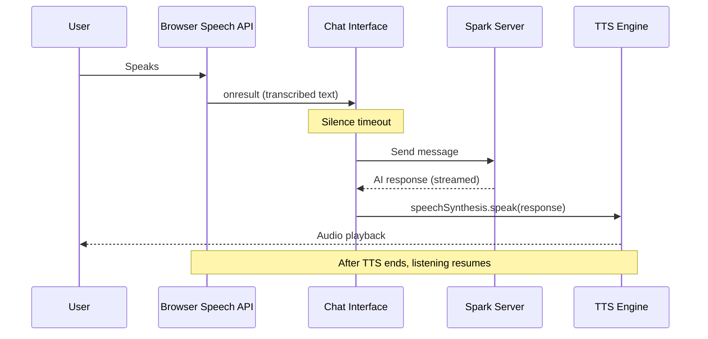

# Voice

Spark includes browser-based voice input and a full voice conversation mode using the Web Speech API.

## Requirements

Voice features require a browser that supports the Web Speech API:

- **Chrome / Edge** -- Full support (speech recognition and synthesis)
- **Safari** -- Speech recognition supported; synthesis supported
- **Firefox** -- Limited speech recognition support

The voice buttons are hidden if the browser does not support speech recognition.

## Speech-to-Text Input

The microphone button next to the message input provides one-shot speech-to-text:

1. Click the microphone icon (or press the mic shortcut)
2. Speak your message
3. The transcribed text appears in the input field
4. Review and press Enter to send

This is useful for dictating a single message without enabling full voice mode.

## Voice Conversation Mode

Voice mode provides a hands-free conversational experience with automatic listening and text-to-speech responses.

### Entering Voice Mode

Click the headset icon in the chat header bar. When voice mode is active:

- A status bar appears below the header showing "Voice mode active"
- Spark continuously listens for speech input
- When you stop speaking (after a silence timeout), the message is automatically sent
- The AI's response is read aloud using text-to-speech
- After the TTS finishes, listening resumes automatically

### Voice Selection

The voice mode status bar includes a voice selector dropdown. You can choose from any TTS voice available in your browser/OS. Your preference is saved in `localStorage` and persisted across sessions.

### Exiting Voice Mode

Click the **Exit Voice Mode** button in the status bar, or click the headset icon again.

## How It Works

```mermaid
sequenceDiagram
    participant User
    participant Browser as Browser Speech API
    participant Chat as Chat Interface
    participant Spark as Spark Server
    participant TTS as TTS Engine

    User->>Browser: Speaks
    Browser->>Chat: onresult (transcribed text)
    Note over Chat: Silence timeout
    Chat->>Spark: Send message
    Spark-->>Chat: AI response (streamed)
    Chat->>TTS: speechSynthesis.speak(response)
    TTS-->>User: Audio playback
    Note over TTS,Browser: After TTS ends, listening resumes
```

### Lifecycle

1. **Listening** -- The `SpeechRecognition` API captures audio and transcribes in real-time
2. **Silence detection** -- After the user stops speaking, a timer fires to auto-send
3. **Processing** -- The message is sent to Spark and the response streams back
4. **Speaking** -- The response text is spoken using `speechSynthesis`
5. **Loop** -- After TTS completes, listening restarts automatically

## ElevenLabs (optional)

By default, voice mode speaks with the browser's built-in synthesiser, which is
free and works offline but sounds robotic. Spark can optionally use
[ElevenLabs](https://elevenlabs.io) for natural speech instead.

**The browser synthesiser always remains the fallback.** If ElevenLabs is
disabled, has no API key, hits its quota, exceeds your character cap, or simply
fails, the utterance is still spoken by the browser. Voice mode never goes
silent.

### Enabling it

1. Open **Settings → Voice**.
2. Set **Speech engine** to `elevenlabs`.
3. Paste your ElevenLabs **API key**. It is stored in the operating system
   keychain, never written to `config.yaml`, and never sent to the browser --
   all synthesis is proxied through Spark's own server.
4. Press **Test Connection** to confirm, then choose a **default voice**.

### Models

| Model | Speed | Cost |
|-------|-------|------|
| `eleven_flash_v2_5` (default) | ~75 ms, real-time | **Half price** (0.5 credits/character) |
| `eleven_multilingual_v2` | Slower | 1 credit/character |
| `eleven_v3` | Slowest, most expressive | 1 credit/character |

Flash is the default because it is both the fastest and the cheapest, which
matters in a debate where every turn is synthesised.

### Voices in debate and panel

When ElevenLabs is enabled, the conversation creation wizard shows a **voice
picker beside each agent** (the debaters and judge; the moderator and each
panellist). Distinct voices are pre-selected automatically, so a multi-voice
debate works with no configuration -- you can override any of them. The human
panellist has no voice: they speak for themselves.

### Interaction modes

Voice mode in debate and panel can behave in three ways, set in Settings and
switchable live from the voice bar:

- **Listen along** (default) -- agent turns are spoken as they land. The
  microphone opens only when you hold the floor or press it.
- **Immersive** -- the microphone stays open so you can interject. It is
  suppressed while Spark is speaking, so it never transcribes its own audio.
- **Listen only** -- narration only; the microphone never opens.

### Cost controls

- **Monthly character cap** -- ElevenLabs meters per character. Set a cap
  (0 means unlimited); once reached, Spark falls back to the browser voice.
  Usage is shown in Settings.
- **Audio cache** -- synthesised audio is cached by content, so replaying a
  debate or re-reading a turn costs nothing and is billed no characters.

### What ElevenLabs does not replace

Speech-to-**text** (the microphone and dictation) still uses the browser's Web
Speech API. ElevenLabs replaces only the spoken output.

## Limitations

- Speech recognition accuracy depends on the browser's speech engine (most use cloud-based recognition)
- TTS voice quality varies by operating system and installed voice packs
- Voice mode requires an active microphone permission in the browser
- Background noise may cause false triggers; use in a quiet environment for best results
- Long AI responses may take time to read aloud; the next listening cycle starts only after TTS finishes
